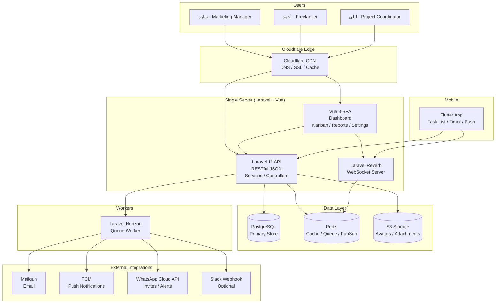
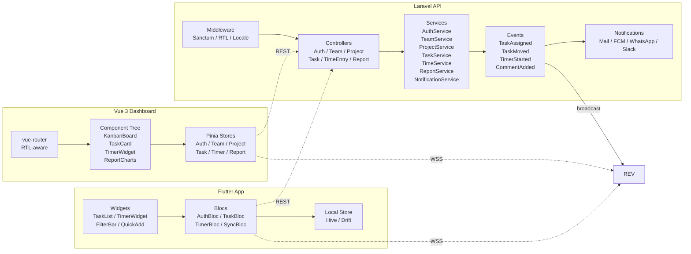

# ARCHITECTURE — TaskSync Pro (SAAS-001)

> **Gate:** 3 · **Owner:** Principal System Architect (Vikram Rao) · **Status:** Locked
> **Consumes:** PRD, PERSONAS, JOURNEY_MAP, PROTOTYPE_SPEC, DESIGN_SYSTEM
> **Produces:** Tech Stack Decision Record, Component Diagram, Data Flow, Scaling Strategy, Traceability Matrix
> **Next:** TKT-005 → performance-architect · TKT-006 → data-schema-engineer

---

## 1. Tech Stack Decision Record

| Layer | Choice | Version | Rationale |
|---|---|---|---|
| **Backend** | Laravel | 11.x (API-only) | PHP ecosystem maturity, Eloquent ORM, Sanctum auth, built-in queue/events/mail, Reverb WebSocket. Fits 3-20 team scale. Arabic-first community packages. |
| **Dashboard** | Vue 3 + Pinia | 3.5+ | React alternative optional but Vue 3 has better Arabic/RTL ecosystem (Vuetify RTL, Vee-validate i18n). Pinia simpler than Redux. Smaller bundle than React. |
| **Mobile** | Flutter | 3.24+ | Single codebase iOS/Android. Bloc for state (proven in production Arabic apps). Firebase plugin ecosystem. RTL support native. |
| **Database** | PostgreSQL | 16 | JSONB for flexible labels/metadata. Full-text search for Arabic (pg_trgm). Superior concurrency vs MySQL. |
| **Cache/Queue** | Redis | 7.x | Queue driver for Horizon. Cache (Laravel cache tag). Session. Reverb pub/sub backend. |
| **WebSocket** | Laravel Reverb | 1.x | First-party Laravel WebSocket. Redis pub/sub backend. No Pusher dependency cost. Self-hosted. |
| **Storage** | S3-compatible | — | DigitalOcean Spaces (prod). MinIO (dev). League Flysystem abstraction. |
| **CDN** | Cloudflare | — | DNS, DDoS, SSL, edge cache for static assets, API proxy caching. |
| **Email** | Mailgun / SMTP | — | Transactional + invite emails. Laravel Mail queue. |
| **Push** | Firebase Cloud Messaging | — | Mobile push via Laravel Notifications channel. |
| **Queue Monitor** | Laravel Horizon | — | Redis queue dashboard, auto-scaling workers per queue. |

### Decision Rationale Details

**Laravel 11 API-only over other frameworks:**
- Sanctum provides token-based SPA auth + mobile token auth in one package.
- Eloquent serialization to JSON matches API-first approach without extra serializers.
- Reverb is the only first-party PHP WebSocket server — no Node.js bridge needed.
- Arabic localization via `laravel-localization` or built-in `__()` with RTL number formatting.
- Team size (3-20) means single-server viability; Laravel scales down well.

**Vue 3 over React:**
- `vue3-routern` RTL support for Arabic routes (`/ar/dashboard` vs `/en/dashboard`).
- Pinia stores are half the boilerplate of Redux Toolkit.
- Vuetify or PrimeVue have mature Arabic/RTL component libraries.
- Reactive refs simpler for real-time board updates (drag-and-drop without external lib).

**Flutter over React Native:**
- True native performance for timer (background isolates, audio notifications).
- `flutter_bloc` pattern maps cleanly to Laravel service layer contracts.
- RTL support is built-in (`Directionality` widget), no community hacks.
- Offline-first with `hive` or `drift` local DB — LRU sync on reconnect.

**PostgreSQL over MySQL:**
- JSONB for task labels, metadata, custom fields (MVP avoids separate table).
- `pg_trgm` for Arabic fuzzy search (`ILIKE '%مهمة%'` with trigram indexing).
- `ROW_NUMBER()` window functions for workload distribution queries.
- PostGIS ready for future location-based features.

---

## 2. System Context & Component Diagram

### Isometric Diagram

A FossFLOW model is checked in at `docs/SAAS-001_Architecture.fossflow.json`. Import via FossFLOW PWA for interactive isometric view.

### System Context (C4 Level 1)



### Component Diagram (C4 Level 2)



---

## 3. Screens → Components Traceability

### Web Dashboard (Vue 3)

| Screen | Route | Components | States | Shared With |
|---|---|---|---|---|
| **Landing & Signup** | `/`, `/register` | `NavBar`, `HeroBanner`, `FeatureCards`, `PricingTable`, `SignupForm`, `Footer` | loading (skeleton), error (network banner), edge (RTL switch) | — |
| **Login** | `/login` | `LoginForm`, `SocialAuthButtons`, `ForgotPasswordLink` | loading, error (credentials), edge (locale redirect) | Flutter: same form |
| **Workspace Setup** | `/setup` | `ProgressStepper`, `WorkspaceForm`, `MemberInviteInput`, `TemplateCards`, `IndustrySelect` | empty (no members), loading, error (slug taken), edge (skip invite) | — |
| **Dashboard** | `/dashboard` | `ProjectCardGrid`, `MemberWorkloadChart`, `UpcomingDeadlines`, `QuickStatsBar`, `TimerFab` | empty (no projects→CTA), loading, error (retry) | Flutter: home screen |
| **Kanban Board** | `/projects/:id/board` | `KanbanColumn`, `TaskCard`, `AddTaskFab`, `ProjectHeader`, `FilterBar`, `ColumnDragHandle` | empty (illustration+CTA), loading (skeleton), error (sync badge), edge (overflow scroll, long title tooltip) | — |
| **Task Detail** | `/tasks/:id` (modal) | `TaskDetailModal`, `CommentThread`, `AttachmentList`, `TimerToggle`, `StatusDropdown`, `PriorityBadge`, `AssigneeSelect`, `DueDatePicker` | open/loading/error/saving/edge (long comment scroll) | Flutter: Task detail screen |
| **Timeline/Gantt** | `/projects/:id/timeline` | `GanttChart`, `TaskBar`, `DateRangeHeader`, `ZoomControl` | empty, loading, error | — |
| **Time Reports** | `/reports/time` | `DateRangePicker`, `KpiCardRow`, `BarChart`, `PieChart`, `ExportButton`, `DataTable`, `FilterPanel` | empty (illustration), loading (shimmer), error (retry), edge (no data→show task completion) | — |
| **Team Settings** | `/settings/team` | `TeamMemberList`, `MemberRoleSelect`, `InviteInput`, `DeleteMemberConfirm` | loading, error | — |
| **Profile Settings** | `/settings/profile` | `ProfileForm`, `AvatarUpload`, `LocaleSelect`, `TimezoneSelect`, `NotificationPreferences` | loading, saving, error | Flutter: Profile screen |
| **Billing** | `/settings/billing` | `PlanCard`, `PaymentMethodForm`, `InvoiceHistory`, `UpgradeButton` | loading, error | — |

### Mobile App (Flutter)

| Screen | Route | Widgets | Shared With |
|---|---|---|---|
| **Login/Register** | `/login`, `/register` | `LoginForm`, `RegisterForm`, `BiometricAuth` | Web (same flow) |
| **Home** | `/` | `TaskList`, `TodayTasks`, `TimerPersistentBar`, `QuickStats`, `FabAddTask` | Web Dashboard |
| **Task List** | `/tasks` | `TaskFilterBar`, `TaskListItem`, `PriorityChip`, `StatusChip`, `PullToRefresh` | — |
| **Task Detail** | `/tasks/:id` | `TaskDetailView`, `CommentSection`, `TimerControl`, `AttachmentGallery`, `VoiceInputFab` | Web Task Detail modal |
| **Timer** | `/timer` (bottom sheet) | `TimerDisplay`, `TaskSelector`, `ManualEntryForm`, `NoteField` | Web Timer modal |
| **Profile** | `/profile` | `ProfileForm`, `AvatarUpload`, `LocaleSelect`, `ThemeToggle` | Web Profile settings |

### Shared Components (cross-platform)

| Component | Web (Vue) | Mobile (Flutter) | Props / State |
|---|---|---|---|
| `TaskCard` | `TaskCard.vue` | `TaskCard.dart` | title, assignee, priority, dueDate, status, isDragging |
| `TimerWidget` | `TimerWidget.vue` | `TimerWidget.dart` | elapsed, isRunning, taskId, onToggle |
| `PriorityBadge` | `PriorityBadge.vue` | `PriorityBadge.dart` | priority (high/med/low) |
| `StatusChip` | `StatusChip.vue` | `StatusChip.dart` | status (todo/in_progress/done) |
| `AvatarGroup` | `AvatarGroup.vue` | `AvatarGroup.dart` | users[], max, size |
| `CommentThread` | `CommentThread.vue` | `CommentThread.dart` | taskId, comments[] |
| `AttachmentPreview` | `AttachmentPreview.vue` | `AttachmentPreview.dart` | files[], onUpload |
| `FilterBar` | `FilterBar.vue` | `FilterBar.dart` | filters[], onChange |
| `ConfirmDialog` | `ConfirmDialog.vue` | `ConfirmDialog.dart` | title, message, confirmLabel, onConfirm |

---

## 4. Data Flow for Core Journeys

### 4.1 Create Task → Save → Notify → Render on All Platforms

```
User (Web)                     Vue Dashboard              Laravel API                PostgreSQL      Reverb      Flutter App
    │                              │                          │                       │              │             │
    │  Click "+" on Kanban         │                          │                       │              │             │
    │─────────────────────────────>│                          │                       │              │             │
    │                              │  POST /api/projects/     │                       │              │             │
    │                              │  {id}/tasks              │                       │              │             │
    │  Show loading skeleton       │─────────────────────────>│                       │              │             │
    │<─────────────────────────────│                          │                       │              │             │
    │                              │                          │  TaskService::create() │              │             │
    │                              │                          │  Validate + authorize  │              │             │
    │                              │                          │  ───────────────────────────────────>│             │
    │                              │                          │  <──INSERT task───────│              │             │
    │                              │                          │                       │              │             │
    │                              │                          │  Dispatch:             │              │             │
    │                              │                          │  ─ TaskAssigned event  │              │             │
    │                              │                          │  ─→ broadcast via WS  │──────────────>│             │
    │                              │                          │  ─→ queue notification │              │             │
    │                              │                          │  (mail/FCM/WhatsApp)   │              │             │
    │                              │                          │                       │              │             │
    │  <──201 Created──────────────│                          │                       │              │             │
    │                              │                          │                       │              │             │
    │                              │  Pinia store:            │                       │              │             │
    │                              │  appendTask()            │                       │              │             │
    │                              │  → Kanban re-renders     │                       │              │             │
    │  <──Task appears on board────│                          │                       │              │             │
    │                              │                          │                       │              │             │
    │                              │                          │                       │              │  <──WS event│
    │                              │                          │                       │              │  TaskUpdated│
    │                              │                          │                       │              │             │
    │                              │                          │                       │              │  Bloc:      │
    │                              │                          │                       │              │  emit(state) │
    │                              │                          │                       │              │  → UI update│
```

### 4.2 Real-Time Kanban Drag-and-Drop

```
User drags card     Vue (vuedraggable)       Pinia              Laravel API          Reverb         Other Users
      │                    │                    │                    │                 │                │
      │  dragstart         │                    │                    │                 │                │
      │───────────────────>│                    │                    │                 │                │
      │                    │  Optimistic update │                    │                 │                │
      │                    │───────────────────>│                    │                 │                │
      │                    │  Pinia:            │                    │                 │                │
      │                    │  moveTask()        │                    │                 │                │
      │                    │  → reorder column  │                    │                 │                │
      │                    │                    │                    │                 │                │
      │  ─── Card moves ───│                    │                    │                 │                │
      │                    │                    │  PATCH /api/tasks/  │                 │                │
      │                    │                    │  {id}/move         │                 │                │
      │                    │                    │  {status, position} │                 │                │
      │                    │                    │────────────────────>│                 │                │
      │                    │                    │                    │ TaskService::    │                │
      │                    │                    │                    │ moveTask()       │                │
      │                    │                    │                    │ → UPDATE DB      │                │
      │                    │                    │                    │                  │                │
      │                    │                    │                    │ broadcast        │                │
      │                    │                    │                    │ TaskMoved event  │                │
      │                    │                    │                    │─────────────────>│                │
      │                    │                    │                    │                  │                │
      │                    │                    │  <──200 OK─────────│                  │                │
      │                    │                    │                    │                  │  <──WS event   │
      │                    │                    │  Commit optimistic │                  │  TaskMoved     │
      │                    │                    │  ←─────────────────│                  │                │
      │                    │                    │                    │                  │  Update local  │
      │                    │                    │                    │                  │  state → rerender
      │                    │                    │                    │                  │────────────────>
```

### 4.3 Time Tracking with Offline Resilience

```
User taps Play         Flutter App            Bloc               Local DB (Hive)     Laravel API        Reverb
      │                     │                   │                     │                  │                │
      │  Tap play button    │                   │                     │                  │                │
      │─────────────────────>│                   │                     │                  │                │
      │                     │  TimerBloc:        │                     │                  │                │
      │                     │  startTimer(taskId)│                     │                  │                │
      │                     │───────────────────>│                     │                  │                │
      │                     │                   │  ── queue event ───>│                  │                │
      │                     │                   │  save(TimeEntry     │                  │                │
      │                     │                   │    started_at,      │                  │                │
      │                     │                   │    pending: true)   │                  │                │
      │                     │                   │                     │                  │                │
      │  48x48 pulse anim   │                   │                     │                  │                │
      │<─────────────────────│                   │                     │                  │                │
      │                     │                   │                     │                  │                │
      │  ── timer ticks ────│                   │                     │                  │                │
      │                     │                   │                     │                  │                │
      │  User taps Pause    │                   │                     │                  │                │
      │─────────────────────>│                   │                     │                  │                │
      │                     │                   │  POST /api/tasks/   │                  │                │
      │                     │                   │  {id}/time-entries/ │                  │                │
      │                     │                   │  stop               │                  │                │
      │                     │                   │──────────────────────────────────────>│                │
      │                     │                   │                     │                  │                │
      │                     │                   │                     │  TimeService::   │                │
      │                     │                   │                     │  stopTimer()     │                │
      │                     │                   │                     │  → UPDATE        │                │
      │                     │                   │                     │  duration_minutes│                │
      │                     │                   │                     │                  │                │
      │                     │                   │                     │  Broadcast       │                │
      │                     │                   │                     │  TimerStopped    │                │
      │                     │                   │                     │─────────────────>│                │
      │                     │                   │                     │                  │                │
      │                     │                   │  <──200 OK──────────│                  │                │
      │                     │                   │                     │                  │                │
      │                     │                   │  ── sync success ──>│  mark pending:   │                │
      │                     │                   │                     │  false           │                │
```

### 4.4 Workspace Setup + Invite Flow

```
User (Web)            Vue Setup Wizard            Laravel API           Postgres           Mail/WhatsApp
    │                        │                        │                   │                    │
    │  Step 1: Workspace     │                        │                   │                    │
    │  name + industry       │                        │                   │                    │
    │───────────────────────>│                        │                   │                    │
    │                        │  POST /api/teams       │                   │                    │
    │                        │  {name, industry}      │                   │                    │
    │                        │───────────────────────>│                   │                    │
    │                        │                        │  TeamService::    │                   │
    │                        │                        │  create()         │                   │
    │                        │                        │──────────────────>│                   │
    │  <──201 + team_id──────│                        │                   │                    │
    │                        │                        │                   │                    │
    │  Step 2: Invite        │                        │                   │                    │
    │  emails/WhatsApp       │                        │                   │                    │
    │───────────────────────>│                        │                   │                    │
    │                        │  POST /api/teams/{id}/ │                   │                    │
    │                        │  invitations           │                   │                    │
    │                        │  {emails[], channel}   │                   │                    │
    │                        │───────────────────────>│                   │                    │
    │                        │                        │  InviteService::  │                   │
    │                        │                        │  sendBatch()      │                   │
    │                        │                        │  ── queue each ──>│                   │
    │                        │                        │                   │                    │
    │                        │                        │  Horizon job:      │                   │
    │                        │                        │  SendInviteMail    │                   │
    │                        │                        │───────────────────────────────────────>│
    │                        │                        │                   │                    │
    │                        │                        │  (or WhatsApp)    │                   │
    │                        │                        │─────────────────────────────────────────>│
    │                        │                        │                   │                    │
    │  <──invites sent───────│                        │                   │                    │
    │                        │                        │                   │                    │
    │  Step 3: Template      │                        │                   │                    │
    │  (Scrum/Kanban/Basic)  │                        │                   │                    │
    │───────────────────────>│                        │                   │                    │
    │                        │  POST /api/teams/{id}/ │                   │                    │
    │                        │  setup/template        │                   │                    │
    │                        │  {template}            │                   │                    │
    │                        │───────────────────────>│                   │                    │
    │                        │                        │  seed default     │                   │
    │                        │                        │  columns/labels   │                   │
    │                        │                        │──────────────────>│                   │
    │                        │                        │                   │                    │
    │  <──redirect /dashboard│                        │                   │                    │
```

---

## 5. Laravel Service Layer Design

### Service Class Hierarchy

```
app/Services/
├── AuthService.php           # Register, login, OAuth, password reset
├── TeamService.php           # CRUD, member management, subscription
├── ProjectService.php        # CRUD, archive, duplicate, timeline
├── TaskService.php           # CRUD, move, assign, filter, bulk operations
├── TimeService.php           # Start/stop timer, manual entry, daily summary
├── ReportService.php         # Time report, workload, burndown, export (PDF/CSV)
├── InviteService.php         # Send invites (mail/WhatsApp), accept/reject
├── NotificationService.php   # Channel dispatch (mail/FCM/WhatsApp/Slack)
├── FileService.php           # Upload, resize avatar, generate thumbnail
└── SubscriptionService.php   # Plan check, usage limits, Stripe billing
```

### Service Pattern Contract

```php
// Example: TaskService
class TaskService
{
    public function __construct(
        private TaskRepository $tasks,
        private ProjectRepository $projects,
        private DispatchableBus $bus, // Events + Queue
    ) {}

    public function create(array $data, User $user): Task
    {
        // 1. Authorize
        Gate::authorize('create', [Task::class, $data['project_id']]);

        // 2. Validate plan limits
        $team = $user->currentTeam;
        throw_if($team->tasks()->count() >= $team->plan->max_tasks,
            PlanLimitExceededException::class);

        // 3. Create with event
        return DB::transaction(function () use ($data, $user) {
            $task = $this->tasks->create(array_merge($data, [
                'creator_id' => $user->id,
            ]));
            $this->bus->dispatch(new TaskCreated($task));
            return $task;
        });
    }

    public function move(int $taskId, string $status, int $position): Task
    {
        // Optimistic concurrency via updated_at check
        // Broadcast TaskMoved event
        // Recalculate column positions (position column)
    }

    public function assign(int $taskId, int $assigneeId): Task
    {
        // Dispatch TaskAssigned notification (mail/FCM/WhatsApp)
    }
}
```

### Repository Pattern Decision

**Use selective repositories, not generic.** Eloquent models are the primary data access layer. Repositories only where:
1. Complex queries need isolation (ReportService — aggregations, window functions).
2. Testing requires mock data source (TimeRepository — replaceable for test).
3. Cross-model queries (SearchRepository — full-text across tasks/projects/comments).

```php
// Repositories are minimal; most queries use Eloquent scopes directly.
app/Repositories/
├── ReportRepository.php      # Aggregation queries (time reports, workload)
├── SearchRepository.php      # Full-text search (pg_trgm + tsvector)
└── SubscriptionRepository.php # Stripe/Plan queries
```

### Event/Listener Map

| Event | Broadcast | Queue Listeners |
|---|---|---|
| `TaskCreated` | `TaskCreated` channel | SendAssignedNotification, UpdateTimelineCache |
| `TaskMoved` | `Task.{id}` channel | UpdateProjectCache, LogActivity |
| `TaskAssigned` | `Task.{id}` channel | SendAssignedNotification (Mail/FCM/WhatsApp) |
| `TimerStarted` | `Task.{id}` channel | — |
| `TimerStopped` | `Task.{id}` channel | UpdateTimeCache |
| `CommentAdded` | `Task.{id}` channel | SendMentionNotification, SendPush |
| `MemberJoined` | `Team.{id}` channel | WelcomeEmail, UpdateMemberCache |
| `PlanUpgraded` | — | StripeSync, UnlockFeatures |

### Queue Architecture (Horizon)

```env
# config/horizon.php — three queue tiers
QUEUE_TIERS:
  high:    notifications, invites         # processed immediately, 3 workers
  default: reports, email, webhooks       # standard, 5 workers
  low:     cleanup, exports               # batch, 1 worker
```

---

## 6. Directory Structure

```
backend/
├── app/
│   ├── Console/
│   │   └── Commands/
│   │       ├── SyncPlanLimits.php
│   │       ├── GenerateDailyDigest.php
│   │       └── CleanupExpiredInvites.php
│   ├── Exceptions/
│   │   ├── PlanLimitExceededException.php
│   │   ├── TimerAlreadyRunningException.php
│   │   └── InviteExpiredException.php
│   ├── Http/
│   │   ├── Controllers/
│   │   │   └── Api/
│   │   │       ├── AuthController.php
│   │   │       ├── TeamController.php
│   │   │       ├── ProjectController.php
│   │   │       ├── TaskController.php
│   │   │       ├── TimeEntryController.php
│   │   │       ├── CommentController.php
│   │   │       ├── ReportController.php
│   │   │       ├── InviteController.php
│   │   │       ├── LabelController.php
│   │   │       ├── FileController.php
│   │   │       └── SubscriptionController.php
│   │   ├── Middleware/
│   │   │   ├── SetLocale.php              # RTL locale from Accept-Language
│   │   │   └── VerifyPlanLimit.php         # Check quota before write
│   │   ├── Requests/
│   │   │   ├── StoreTaskRequest.php
│   │   │   ├── MoveTaskRequest.php
│   │   │   ├── StartTimerRequest.php
│   │   │   └── GenerateReportRequest.php
│   │   └── Resources/
│   │       ├── TaskResource.php
│   │       ├── ProjectResource.php
│   │       └── TimeEntryResource.php
│   ├── Models/
│   │   ├── User.php
│   │   ├── Team.php
│   │   ├── Project.php
│   │   ├── Task.php
│   │   ├── TimeEntry.php
│   │   ├── Comment.php
│   │   ├── Label.php
│   │   ├── Invitation.php
│   │   ├── Plan.php
│   │   └── Subscription.php
│   ├── Services/
│   │   ├── AuthService.php
│   │   ├── TeamService.php
│   │   ├── ProjectService.php
│   │   ├── TaskService.php
│   │   ├── TimeService.php
│   │   ├── ReportService.php
│   │   ├── InviteService.php
│   │   ├── NotificationService.php
│   │   ├── FileService.php
│   │   └── SubscriptionService.php
│   ├── Events/
│   │   ├── TaskCreated.php
│   │   ├── TaskMoved.php
│   │   ├── TaskAssigned.php
│   │   ├── TimerStarted.php
│   │   ├── TimerStopped.php
│   │   ├── CommentAdded.php
│   │   ├── MemberJoined.php
│   │   └── PlanUpgraded.php
│   ├── Listeners/
│   │   ├── SendTaskAssignedNotification.php
│   │   ├── UpdateProjectTimelineCache.php
│   │   └── LogTaskActivity.php
│   └── Notifications/
│       ├── TaskAssigned.php
│       ├── TaskDueSoon.php
│       ├── MemberInvited.php
│       ├── TimerReminder.php
│       └── WeeklyDigest.php
├── config/
│   ├── horizon.php
│   ├── reverb.php
│   ├── sanctum.php
│   └── filesystems.php
├── database/
│   ├── migrations/
│   │   ├── 0001_create_teams_table.php
│   │   ├── 0002_create_project_table.php
│   │   ├── 0003_create_tasks_table.php
│   │   ├── 0004_create_time_entries_table.php
│   │   ├── 0005_create_comments_table.php
│   │   ├── 0006_create_labels_table.php
│   │   ├── 0007_create_invitations_table.php
│   │   ├── 0008_create_plans_table.php
│   │   └── 0009_create_subscriptions_table.php
│   ├── factories/
│   └── seeders/
│       ├── PlanSeeder.php
│       └── DemoDataSeeder.php
├── routes/
│   └── api.php                # All API routes
├── storage/
│   ├── app/public/
│   └── exports/               # Generated PDFs/CSVs
└── tests/
    ├── Feature/
    │   ├── TaskTest.php
    │   ├── TimeTrackingTest.php
    │   └── ReportTest.php
    └── Unit/
        ├── Services/
        └── Models/

frontend/
├── src/
│   ├── assets/
│   │   ├── styles/
│   │   │   ├── main.css           # Tailwind imports + custom
│   │   │   └── rtl.css            # RTL overrides for Arabic
│   │   └── images/
│   ├── components/
│   │   ├── common/
│   │   │   ├── AppNavBar.vue
│   │   │   ├── TaskCard.vue
│   │   │   ├── PriorityBadge.vue
│   │   │   ├── StatusChip.vue
│   │   │   ├── AvatarGroup.vue
│   │   │   ├── TimerWidget.vue
│   │   │   ├── ConfirmDialog.vue
│   │   │   └── EmptyState.vue
│   │   ├── kanban/
│   │   │   ├── KanbanBoard.vue
│   │   │   ├── KanbanColumn.vue
│   │   │   └── AddTaskFab.vue
│   │   ├── task/
│   │   │   ├── TaskDetailModal.vue
│   │   │   ├── CommentThread.vue
│   │   │   └── AttachmentList.vue
│   │   ├── report/
│   │   │   ├── KpiCard.vue
│   │   │   ├── BarChart.vue
│   │   │   ├── PieChart.vue
│   │   │   └── ExportButton.vue
│   │   ├── timer/
│   │   │   ├── TimerModal.vue
│   │   │   └── ManualEntryForm.vue
│   │   ├── team/
│   │   │   ├── MemberList.vue
│   │   │   └── InviteInput.vue
│   │   └── workspace/
│   │       ├── ProgressStepper.vue
│   │       ├── WorkspaceForm.vue
│   │       └── TemplateSelector.vue
│   ├── composables/
│   │   ├── useAuth.js
│   │   ├── useKanban.js          # drag-and-drop logic
│   │   ├── useTimer.js
│   │   └── useRTL.js             # direction, locale
│   ├── layout/
│   │   ├── DashboardLayout.vue
│   │   ├── AuthLayout.vue
│   │   └── PublicLayout.vue
│   ├── locales/
│   │   ├── ar.json               # Arabic translations
│   │   └── en.json
│   ├── plugins/
│   │   ├── axios.js
│   │   ├── echo.js               # Laravel Echo + Reverb
│   │   └── vue-i18n.js
│   ├── router/
│   │   └── index.js              # RTL-aware route definitions
│   ├── stores/
│   │   ├── auth.js
│   │   ├── team.js
│   │   ├── project.js
│   │   ├── task.js
│   │   ├── timer.js
│   │   └── report.js
│   └── views/
│       ├── LandingPage.vue
│       ├── LoginView.vue
│       ├── RegisterView.vue
│       ├── WorkspaceSetup.vue
│       ├── DashboardView.vue
│       ├── KanbanView.vue
│       ├── TimelineView.vue
│       ├── ReportsView.vue
│       ├── TeamSettingsView.vue
│       └── ProfileView.vue
├── tailwind.config.js
├── vite.config.js
└── package.json

mobile/
├── lib/
│   ├── core/
│   │   ├── api/
│   │   │   ├── api_client.dart       # Dio HTTP client
│   │   │   ├── api_interceptor.dart  # Auth token, retry, locale
│   │   │   └── endpoints.dart
│   │   ├── router/
│   │   │   └── app_router.dart
│   │   ├── theme/
│   │   │   ├── app_theme.dart
│   │   │   ├── colors.dart
│   │   │   └── rtl.dart
│   │   ├── locale/
│   │   │   ├── app_localizations.dart
│   │   │   ├── ar.dart
│   │   │   └── en.dart
│   │   └── services/
│   │       ├── local_storage.dart    # Hive/Database
│   │       ├── notification_service.dart
│   │       └── connectivity_service.dart
│   ├── features/
│   │   ├── auth/
│   │   │   ├── bloc/
│   │   │   │   ├── auth_bloc.dart
│   │   │   │   └── auth_event.dart
│   │   │   │   └── auth_state.dart
│   │   │   ├── views/
│   │   │   │   ├── login_screen.dart
│   │   │   │   └── register_screen.dart
│   │   │   └── widgets/
│   │   ├── home/
│   │   │   ├── bloc/
│   │   │   └── views/
│   │   │       └── home_screen.dart
│   │   ├── tasks/
│   │   │   ├── bloc/
│   │   │   ├── views/
│   │   │   │   ├── task_list_screen.dart
│   │   │   │   └── task_detail_screen.dart
│   │   │   └── widgets/
│   │   ├── timer/
│   │   │   ├── bloc/
│   │   │   │   ├── timer_bloc.dart
│   │   │   │   ├── timer_event.dart
│   │   │   │   └── timer_state.dart
│   │   │   └── widgets/
│   │   │       └── timer_widget.dart
│   │   ├── profile/
│   │   │   └── views/
│   │   │       └── profile_screen.dart
│   │   └── invites/
│   │       └── views/
│   │           └── accept_invite_screen.dart
│   └── main.dart
├── test/
├── pubspec.yaml
└── android/ & ios/
```

---

## 7. Infrastructure Requirements

### Minimum Deployment Spec (Single Server)

| Resource | Value | Notes |
|---|---|---|
| **vCPU** | 2 cores | Intel/AMD x86, 2.5GHz+ |
| **RAM** | 4 GB | 1GB for PHP-FPM + Laravel, 1GB Redis, 512MB Reverb, 1GB PostgreSQL, rest OS |
| **Storage** | 50 GB NVMe SSD | For DB + uploads + logs; expandable via S3 offload |
| **Bandwidth** | 2 TB/month | Estimated 500MB/day API + assets for 50 teams |
| **OS** | Ubuntu 24.04 LTS | PHP 8.3+, Nginx, Supervisor (Horizon + Reverb) |
| **Provider** | DigitalOcean / Hetzner / Linode | ~$48-60/month |

### Network Architecture

```
Internet
    │
    v
Cloudflare (CDN + WAF + SSL termination)
    │
    v
Nginx reverse proxy (single server)
    ├── /api/*          → PHP-FPM (Laravel)
    ├── /storage/*      → Nginx direct (cached assets)
    ├── /broadcasting/*  → Laravel Reverb (WebSocket)
    ├── /* (dashboard)  → Vite build (static files)
    └── /reports/*      → PDF/CSV download (Laravel streamed response)

PHP-FPM pool: dynamic (5-20 children), pm.max_children=20
```

### Service Stack

| Service | Purpose | Configuration |
|---|---|---|
| **PHP-FPM 8.3** | Laravel application server | pm.max_children=20, request_terminate_timeout=60s |
| **Nginx** | Reverse proxy + static files | gzip on, brotli preferred, caching headers |
| **PostgreSQL 16** | Primary database | shared_buffers=1GB, effective_cache_size=3GB, work_mem=64MB |
| **Redis 7** | Cache + Queue + Reverb pub/sub | maxmemory=1GB, maxmemory-policy=allkeys-lru |
| **Laravel Horizon** | Queue worker daemon | 3 queues (high=3, default=5, low=1 workers) |
| **Laravel Reverb** | WebSocket server | port 6001, Redis pub/sub backend, scaling: 1-4 workers |
| **Supervisor** | Process manager | Horizon + Reverb daemonized |
| **MinIO** (dev) / Spaces (prod) | S3 file storage | presigned URLs for uploads, 15-min expiry |

### Scaling Path

| Stage | Users | Teams | Actions |
|---|---|---|---|
| **MVP** (1-50 teams) | 3-20/team | Single server | 2 vCPU, 4GB RAM, $48/mo |
| **Growth** (50-200 teams) | 50-200 | Scale vertically → 4 vCPU, 8GB RAM, $84/mo |
| **Scale** (200-1000 teams) | 500-2000 | Split: app server + DB server + Reverb server, $200+/mo |
| **Enterprise** (1000+ teams) | 5000+ | Horizontal: N LB → multiple app nodes, RDS, ElastiCache, $500+/mo |

Horizontal scaling triggers:
1. Split `reverb` to dedicated node (when WS connections > 1000 concurrent).
2. Split `postgres` to dedicated node (when DB CPU > 60% sustained).
3. Add read replicas for reports (when report queries > 20% of DB load).
4. Separate `horizon` workers to dedicated node (when queue backlog > 1000 jobs).

---

## 8. Performance Budget

| Metric | Target | Measurement | Violation Action |
|---|---|---|---|
| **API P99 response** | < 200ms | New Relic / Laravel Telescope | Optimize query → add index → cache → refactor |
| **API P50 response** | < 80ms | Laravel Telescope | — |
| **First Contentful Paint** | < 1.5s | Lighthouse / WebPageTest | Lazy routes → code-split → CDN cache |
| **Time to Interactive** | < 2.5s | Lighthouse | Reduce JS bundle → defer non-critical |
| **Lighthouse Performance** | > 90 | CI (lhci) | Fail CI build |
| **Lighthouse Accessibility** | > 95 | CI (lhci) | Fail CI build; WCAG 2.2 AA mandatory |
| **Lighthouse Best Practices** | > 95 | CI (lhci) | — |
| **Lighthouse SEO** | > 95 | CI (lhci) | RTL meta tags, Arabic OG, hreflang |
| **Kanban drag latency** | < 50ms | Performance.now() | Virtual scroll for 100+ cards |
| **WebSocket connect** | < 500ms | Custom metric | Reverb scaling |
| **Report generation** | < 5s (P95) | Horizon job metric | Queue job, cache aggregations |
| **Time entry save** | < 300ms | Custom metric | Offline queue first, sync async |
| **Bundle size (JS)** | < 200KB gzipped | Vite build report | Dynamic imports, tree-shaking |
| **Bundle size (Flutter)** | < 25MB APK | Play Console | Shrink binary, deferred components |

### Caching Strategy

| Cache Key | TTL | Storage | Invalidation |
|---|---|---|---|
| `project:{id}:tasks` | 60s | Redis | On TaskCreated/TaskMoved event |
| `team:{id}:members` | 300s | Redis | On MemberJoined/MemberRemoved |
| `report:time:{hash}` | 600s | Redis | On TimerStopped event |
| `user:{id}:profile` | 600s | Redis | On ProfileUpdated |
| Asset files (JS/CSS) | 1 year | CDN | Vite content hash |
| Avatars (thumbnails) | 7 days | CDN | On avatar upload → purge |

### Database Index Strategy

```sql
-- Core query patterns index
CREATE INDEX idx_tasks_project_status ON tasks (project_id, status, position);
CREATE INDEX idx_tasks_assignee_status ON tasks (assignee_id, status);
CREATE INDEX idx_tasks_due_date ON tasks (due_date) WHERE due_date IS NOT NULL;
CREATE INDEX idx_time_entries_user_started ON time_entries (user_id, started_at DESC);
CREATE INDEX idx_time_entries_task ON time_entries (task_id);
CREATE INDEX idx_comments_task ON comments (task_id, created_at DESC);
CREATE INDEX idx_invitations_email ON invitations (email, team_id);
CREATE INDEX idx_team_user ON team_user (team_id, user_id);

-- Full-text search
CREATE INDEX idx_tasks_search ON tasks USING GIN (to_tsvector('arabic', title || ' ' || COALESCE(description, '')));
CREATE INDEX idx_projects_search ON projects USING GIN (to_tsvector('arabic', name || ' ' || COALESCE(description, '')));
```

---

## 9. State Management

### Frontend (Vue 3 + Pinia)

```js
// stores/auth.js — User session, token, locale
// stores/team.js — Current team, member list, subscription
// stores/project.js — Project list, active project, filters
// stores/task.js — Tasks per project, optimistic updates, drag state
// stores/timer.js — Active timer, elapsed time, recent entries
// stores/report.js — Report filters, chart data, export state
```

Store interaction pattern:

```
Component
    │
    ├─ dispatch action ──→ Pinia Action
    │                           │
    │                           ├─ API call (axios)
    │                           ├─ Optimistic update (if real-time)
    │                           ├─ Error → rollback
    │                           └─ Success → commit state
    │
    └─ reactive state ──→ Pinia State ←── WebSocket (Laravel Echo)
                                              │
                                              ├─ TaskMoved → task store
                                              ├─ TimerStarted → timer store
                                              └─ CommentAdded → task store
```

### Mobile (Flutter + Bloc)

```
Screen (Widget)
    │
    ├─ dispatch Event ──→ Bloc
    │                         │
    │                         ├─ API call (Dio)
    │                         ├─ Local DB write (Hive)
    │                         ├─ Emit state (loading/success/error)
    │                         └─ WebSocket listener → emit state
    │
    └─ render State ──→ BlocBuilder/BlocListener
```

### Offline Strategy

```
Flutter App
    │
    ├─ Online mode:
    │     └─ API calls direct, WS live, cache read-through
    │
    └─ Offline mode:
          ├─ Queue mutations in Hive (pending_changes table)
          ├─ Read from local DB (Hive boxes synced on last online)
          ├─ Show "offline" badge
          └─ On reconnect:
                ├─ Process pending_changes FIFO
                ├─ Conflict resolution: last-write-wins via updated_at
                └─ Sync fresh data from API (GET since={last_sync_at})
```

### Real-Time Summary

| System | Protocol | Backend | Client Library | Ch |
|---|---|---|---|---|
| WebSocket | WSS (port 6001) | Laravel Reverb | Laravel Echo (`echo.js`) | Self-hosted, no recurring cost |
| Fallback | Polling | GET /api/poll | setInterval 30s | For blocked WS connections |
| Reconnection | Exponential backoff | — | Echo `connector.options.reconnect` | Max 5 retries, then offline mode |

---

## 10. Traceability Matrix

### Journey Map → Components → API → Data Model → Tests

| Journey Stage | Screen | Vue Component | API Endpoint | Data Model | Key Test |
|---|---|---|---|---|---|
| Discover → Signup | Landing & Signup | `LandingPage`, `SignupForm` | `POST /api/auth/register` | User | `test_user_can_register()` |
| Create Workspace | Workspace Setup | `WorkspaceSetup`, `WorkspaceForm` | `POST /api/teams` | Team, Plan | `test_create_team_creates_owner()` |
| Invite | Invite Members | `InviteInput`, `MemberStatusList` | `POST /api/teams/{id}/invitations` | Invitation | `test_invite_sends_email()` |
| Create Project | Dashboard (new project) | `ProjectCardGrid`, `CreateProjectModal` | `POST /api/projects` | Project | `test_create_project_with_template()` |
| Add Tasks | Kanban Board | `KanbanBoard`, `AddTaskFab`, `TaskCard` | `POST /api/projects/{id}/tasks` | Task | `test_create_task_increments_position()` |
| Assign | Kanban Board | `TaskDetailModal`, `AssigneeSelect` | `PATCH /api/tasks/{id}/assign` | Task, User | `test_assign_sends_notification()` |
| Track Time | Timer (modal/bottom sheet) | `TimerWidget`, `TimerModal`, `ManualEntryForm` | `POST /api/tasks/{id}/time-entries/start` | TimeEntry | `test_start_timer_creates_entry()` |
| Track Time | Timer (pause) | `TimerWidget` | `PATCH /api/tasks/{id}/time-entries/stop` | TimeEntry | `test_stop_timer_calculates_duration()` |
| Report | Reports Dashboard | `ReportsView`, `BarChart`, `KpiCard`, `ExportButton` | `GET /api/reports/time` | Aggregation query | `test_report_returns_aggregated_data()` |
| Goal | Reports Dashboard (drill-down) | `DataTable` | `GET /api/reports/time?detail=member` | Task, TimeEntry | `test_report_filters_by_date_range()` |
| — | Timeline/Gantt | `TimelineView`, `GanttChart` | `GET /api/projects/{id}/tasks?with_dates=1` | Task (with dates) | `test_timeline_returns_sorted_tasks()` |
| — | Team Settings | `TeamSettingsView`, `MemberList` | `GET /api/teams/{id}/members` | TeamUser (pivot) | `test_admin_can_remove_member()` |
| — | Profile Settings | `ProfileView`, `AvatarUpload` | `PATCH /api/me` | User | `test_user_updates_profile()` |
| — | Billing | `SubscriptionView`, `PlanCard` | `POST /api/subscription/upgrade` | Subscription, Plan | `test_upgrade_plan_unlocks_features()` |

### Journey Friction → Architecture Resolution

| Friction (from Journey Map) | Resolution | Architecture Feature |
|---|---|---|
| [#1 High] Timer forget → manual entry + reminders | `TimeService::manualEntry()`, `TimerReminder` notification | Queue: `TimerReminder` daily at 6pm via cron |
| [#2 High] Workspace complexity → guided wizard | Workspace setup wizard (3-step `ProgressStepper`) | Session-based wizard state, `POST /api/teams/{id}/setup/template` |
| [#3 Med] Invite spam → WhatsApp fallback | `InviteService` dual-channel (email + WhatsApp) | Horizon queue per channel, `WhatsAppNotification` channel |
| [#4 Med] Task form too heavy → minimal + expand | `AddTaskFab` inline form, `TaskDetailModal` for detail | Two endpoints: `POST minimal` + `PATCH with detail` |
| [#5 Low] Inaccurate reports → daily reminders | `DailyDigest` command, `WeeklyDigest` notification | Cron + queue, aggregations via ReportRepository |

---

## 11. Security Considerations

| Area | Implementation |
|---|---|
| **Authentication** | Laravel Sanctum (token-based for SPA + mobile). Google OAuth via Laravel Socialite. |
| **Authorization** | Gates + Policies per model (TaskPolicy, ProjectPolicy). `TeamRoleMiddleware` for owner/admin/member. |
| **Rate Limiting** | `RateLimiter` on API: 60 req/min auth, 300 req/min general, 30 req/min reports. |
| **CORS** | Narrow origin config (production domain only). Sanctum SPA stateful mode for dashboard. |
| **Input Validation** | Laravel Form Requests with Arabic-locale error messages. |
| **SQL Injection** | Eloquent ORM (parameterized queries). Raw queries only in ReportRepository. |
| **XSS** | Vue auto-escaping, Content-Security-Policy headers, user input HTML-stripped. |
| **CSRF** | Sanctum SPA protection + `XSRF-TOKEN` cookie for dashboard. API tokens for mobile. |
| **Upload Validation** | File extension + MIME validation, `FileService` virus scan (ClamAV), 10MB limit. |
| **Encryption at Rest** | PostgreSQL TDE, Laravel `encrypt` cast for sensitive fields. |
| **Encryption in Transit** | Cloudflare SSL (TLS 1.3) + HSTS. |
| **Audit Log** | `spatie/laravel-activitylog` for destructive actions (task delete, member remove, plan change). |

---

## 12. Decision Log

| ID | Decision | Rationale | Alternatives Rejected |
|---|---|---|---|
| ARC-001 | Laravel 11 API-only with Sanctum | SPA + mobile auth unified. No Blade views. | Laravel Breeze (too Blade-heavy), Passport (overkill for token scale) |
| ARC-002 | Vue 3 over React | RTL ecosystem, Pinia simplicity, smaller bundle | React + RTL (cssjanus hacks), Svelte (smaller ecosystem for Arabic) |
| ARC-003 | Laravel Reverb over Pusher | Free self-hosted, no per-connection cost | Pusher ($49/mo for 100 concurrent), Soketi (less mature) |
| ARC-004 | Selective Repository pattern | Only for complex queries, avoid generic abstraction | Full Repository pattern (over-engineering for MVP), Active Record everywhere (hard to mock reports) |
| ARC-005 | PostgreSQL over MySQL | JSONB, pg_trgm, window functions, PostGIS future | MySQL 8 (weaker JSON, no Arabic full-text), MongoDB (wrong paradigm) |
| ARC-006 | Offline: Hive + last-write-wins | Simple, adequate for 3-20 team scale | CRDT (too complex for MVP), CouchDB sync (infra overhead) |
| ARC-007 | Horizon multi-tier queues | Notifications prioritized over exports | Single queue (blocking), SQS (vendor lock-in at small scale) |
| ARC-008 | DigitalOcean Spaces for storage | S3-compatible, no egress fees, Middle East region | AWS S3 (complex pricing), MinIO-only (needs separate infra) |

---

*Generated by Principal System Architect · Gate 3 · 2026-06-25*
*Next: TKT-005 → performance-architect (performance budget, CDN config, caching)*
*TKT-006 → data-schema-engineer (detailed migrations, index tuning, seeders)*
