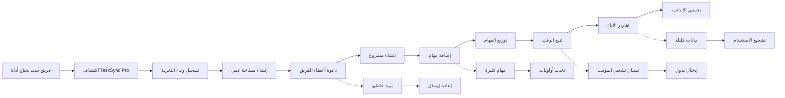

# JOURNEY MAP — TaskSync Pro (SAAS-001)
> Owner: Journey Architect · Gate 1 · Persona: سارة — مديرة فريق تسويق

## المسار (Mermaid)

## تعليقات المراحل
| المرحلة | إجراء المستخدم | الهدف | المشاعر | الاحتكاك | الشاشة |
|----------|----------------|-------|---------|----------|--------|
| Trigger | يواجه صعوبة في إدارة الفريق بالأدوات الحالية | إيجاد حل أفضل | 😤 محبط | - | - |
| Discover | يبحث عن أداة إدارة مشاريع عربية | اكتشاف خيار مناسب | 🤔 فضولي | نتائج بحث محدودة بالعربية | Landing page |
| Signup | يسجل ببريده الإلكتروني | بدء التجربة المجانية | 😊 متفائل | إدخال بيانات | Register form |
| Create Workspace | ينشئ مساحة عمل للفريق | تنظيم الفريق في مكان واحد | 🙂 راض | اختيار الاسم والخطة | Workspace setup |
| Invite | يدعو أعضاء الفريق عبر البريد | جمع الفريق على المنصة | 😐 محايد | رسائل بريد تدخل سبام | Invite members |
| Add Tasks | يضيف المهام مع المواعيد | تحديد العمل المطلوب | 🙂 منتج | إدخال تفاصيل كثيرة | Task create |
| Track Time | يشغل مؤقت الوقت على مهمة | قياس الجهد المبذول | 😐 مركز | نسيان تشغيل المؤقت | Timer widget |
| Report | يطلع على تقارير الأداء | تقييم إنتاجية الفريق | 😊 فخور | بيانات غير دقيقة | Reports page |

## سجل الاحتكاك المرتب
1. [High] نسيان تشغيل/إيقاف مؤقت الوقت → حل: إدخال يدوي + تذكير تلقائي (Screen 4)
2. [High] تعقيد إعداد مساحة العمل للمستخدم الجديد → حل: معالج تدريجي مع نصائح (Screen 2)
3. [Med] رسائل دعوة الفريق تدخل سبام → حل: رابط دعوة + واتساب كنسخة احتياطية (Screen 3)
4. [Med] إدخال تفاصيل مهمة كثيرة يثبط السرعة → حل: نموذج بسيط مع خيار التوسع (Screen 5)
5. [Low] عدم دقة التقارير لضعف استخدام التوقيت → حل: تذكير يومي + إدخال وقت سريع (Screen 6)
