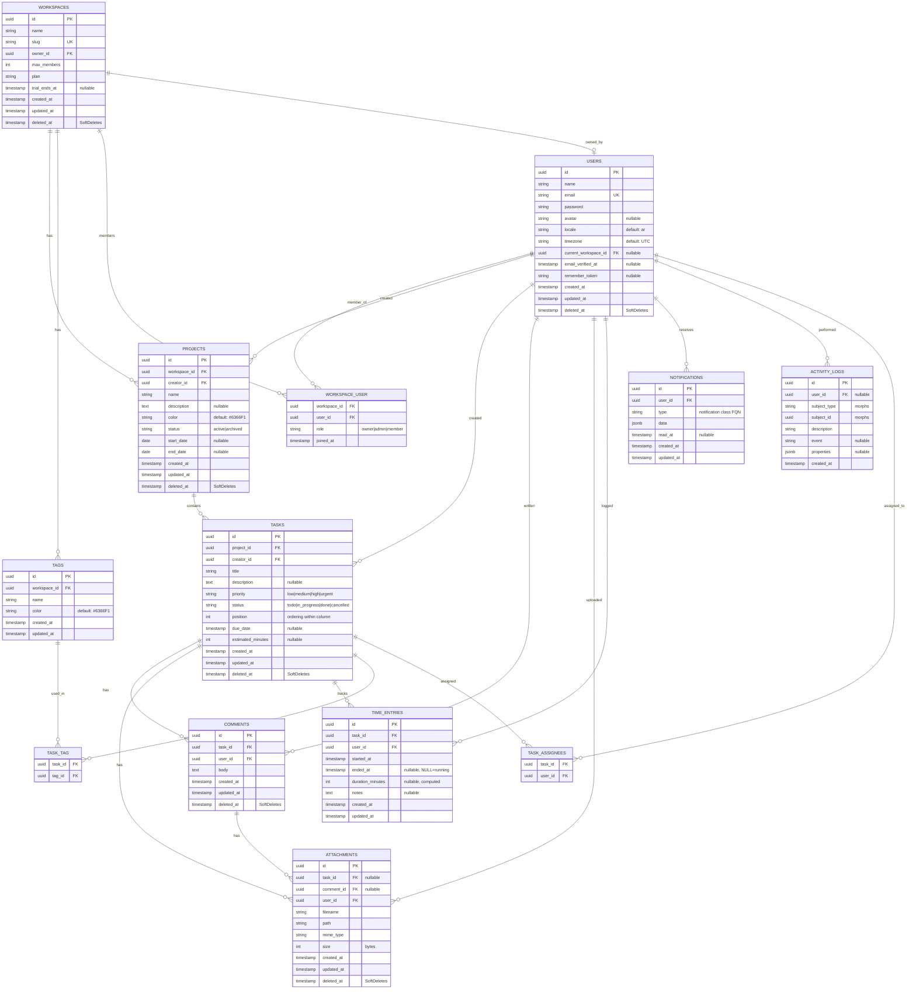
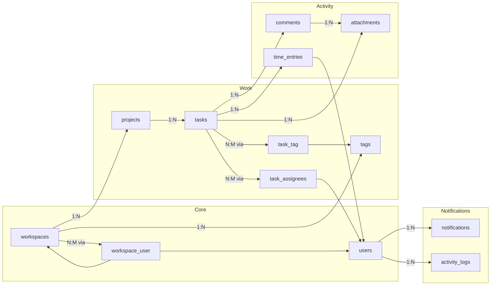

# SCHEMA — TaskSync Pro (SAAS-001)

> **Gate:** 3 · **Owner:** sofi-data-schema-engineer · **Status:** Locked
> **Consumes:** docs/ARCHITECTURE.md (§5 Service Layer, §6 Directory Structure, DB Index Strategy)
> **Next:** TKT-008 → sofi-api-integration-specialist

---

## 1. ER Diagram (Mermaid)

---

## 2. Table Definitions

### 2.1 `workspaces`

| Column | Type | Constraints | Description |
|---|---|---|---|
| id | uuid | PK, default uuid4 | Primary identifier |
| name | varchar(255) | NOT NULL | Workspace display name |
| slug | varchar(255) | UNIQUE, NOT NULL | URL-friendly identifier |
| owner_id | uuid | FK → users.id, NOT NULL | Workspace owner |
| max_members | int | DEFAULT 3 | Plan-based member limit |
| plan | varchar(20) | DEFAULT 'free', CHECK(plan IN ('free','pro','business')) | Subscription tier |
| trial_ends_at | timestamp | NULLABLE | Pro trial expiration |
| created_at | timestamp | NOT NULL | Laravel timestamp |
| updated_at | timestamp | NOT NULL | Laravel timestamp |
| deleted_at | timestamp | NULLABLE | Soft delete |

**Indexes:**
- PK: `workspaces_pkey` ON id
- UNIQUE: `workspaces_slug_unique` ON slug
- FK: `workspaces_owner_id_foreign` ON owner_id → users(id) ON DELETE CASCADE
- BTREE: `idx_workspaces_owner_id` ON owner_id

### 2.2 `users`

| Column | Type | Constraints | Description |
|---|---|---|---|
| id | uuid | PK, default uuid4 | Primary identifier |
| name | varchar(255) | NOT NULL | Display name |
| email | varchar(255) | UNIQUE, NOT NULL | Login identifier |
| password | varchar(255) | NOT NULL | Bcrypt hash |
| avatar | varchar(255) | NULLABLE | S3 path to avatar |
| locale | varchar(10) | DEFAULT 'ar' | Language preference |
| timezone | varchar(100) | DEFAULT 'UTC' | User timezone |
| current_workspace_id | uuid | FK → workspaces.id, NULLABLE | Active workspace |
| email_verified_at | timestamp | NULLABLE | Email verification |
| remember_token | varchar(100) | NULLABLE | "Remember me" token |
| created_at | timestamp | NOT NULL | |
| updated_at | timestamp | NOT NULL | |
| deleted_at | timestamp | NULLABLE | Soft delete |

**Indexes:**
- PK: `users_pkey` ON id
- UNIQUE: `users_email_unique` ON email
- FK: `users_current_workspace_id_foreign` ON current_workspace_id → workspaces(id) ON DELETE SET NULL
- BTREE: `idx_users_current_workspace` ON current_workspace_id
- GIN: `idx_users_name_trgm` ON name (pg_trgm for Arabic name search)

### 2.3 `workspace_user` (pivot)

| Column | Type | Constraints | Description |
|---|---|---|---|
| workspace_id | uuid | FK → workspaces.id | Composite PK |
| user_id | uuid | FK → users.id | Composite PK |
| role | varchar(20) | DEFAULT 'member', CHECK(role IN ('owner','admin','member')) | Permission level |
| joined_at | timestamp | NOT NULL, DEFAULT CURRENT_TIMESTAMP | When user joined |

**Indexes:**
- PK: `workspace_user_pkey` ON (workspace_id, user_id)
- FK: `workspace_user_workspace_id_foreign` → workspaces(id) ON DELETE CASCADE
- FK: `workspace_user_user_id_foreign` → users(id) ON DELETE CASCADE
- BTREE: `idx_workspace_user_user_id` ON user_id
- COMPOSITE: `idx_workspace_user_role` ON (workspace_id, role)

### 2.4 `projects`

| Column | Type | Constraints | Description |
|---|---|---|---|
| id | uuid | PK, default uuid4 | |
| workspace_id | uuid | FK → workspaces.id, NOT NULL | Parent workspace |
| creator_id | uuid | FK → users.id, NOT NULL | Who created it |
| name | varchar(255) | NOT NULL | Project name |
| description | text | NULLABLE | Detailed description |
| color | varchar(7) | DEFAULT '#6366F1' | Hex color for UI |
| status | varchar(20) | DEFAULT 'active', CHECK(status IN ('active','archived')) | Lifecycle |
| start_date | date | NULLABLE | Planned start |
| end_date | date | NULLABLE | Planned end |
| created_at | timestamp | NOT NULL | |
| updated_at | timestamp | NOT NULL | |
| deleted_at | timestamp | NULLABLE | Soft delete |

**Indexes:**
- PK: `projects_pkey` ON id
- FK: `projects_workspace_id_foreign` → workspaces(id) ON DELETE CASCADE
- FK: `projects_creator_id_foreign` → users(id) ON DELETE CASCADE
- BTREE: `idx_projects_workspace_id` ON workspace_id
- BTREE: `idx_projects_creator_id` ON creator_id
- GIN: `idx_projects_search` ON to_tsvector('arabic', name || ' ' || COALESCE(description, ''))

### 2.5 `tasks`

| Column | Type | Constraints | Description |
|---|---|---|---|
| id | uuid | PK, default uuid4 | |
| project_id | uuid | FK → projects.id, NOT NULL | Parent project |
| creator_id | uuid | FK → users.id, NOT NULL | Who created it |
| title | varchar(255) | NOT NULL | Task title |
| description | text | NULLABLE | Task details |
| priority | varchar(10) | DEFAULT 'medium', CHECK(priority IN ('low','medium','high','urgent')) | Importance level |
| status | varchar(20) | DEFAULT 'todo', CHECK(status IN ('todo','in_progress','done','cancelled')) | Kanban column |
| position | int | DEFAULT 0 | Order in Kanban column |
| due_date | timestamp | NULLABLE | Deadline |
| estimated_minutes | int | NULLABLE | Effort estimate |
| created_at | timestamp | NOT NULL | |
| updated_at | timestamp | NOT NULL | |
| deleted_at | timestamp | NULLABLE | Soft delete |

**Indexes:**
- PK: `tasks_pkey` ON id
- FK: `tasks_project_id_foreign` → projects(id) ON DELETE CASCADE
- FK: `tasks_creator_id_foreign` → users(id) ON DELETE CASCADE
- COMPOSITE: `idx_tasks_project_status_position` ON (project_id, status, position) — **Kanban board read path**
- COMPOSITE: `idx_tasks_due_date` ON due_date WHERE due_date IS NOT NULL — **Upcoming deadlines query**
- GIN: `idx_tasks_search` ON to_tsvector('arabic', title || ' ' || COALESCE(description, ''))

### 2.6 `task_assignees` (pivot)

| Column | Type | Constraints | Description |
|---|---|---|---|
| task_id | uuid | FK → tasks.id | Composite PK |
| user_id | uuid | FK → users.id | Composite PK |

**Indexes:**
- PK: `task_assignees_pkey` ON (task_id, user_id)
- FK: → tasks(id) ON DELETE CASCADE
- FK: → users(id) ON DELETE CASCADE
- BTREE: `idx_task_assignees_user_id` ON user_id — **My Tasks query**

### 2.7 `tags`

| Column | Type | Constraints | Description |
|---|---|---|---|
| id | uuid | PK, default uuid4 | |
| workspace_id | uuid | FK → workspaces.id, NOT NULL | Owning workspace |
| name | varchar(50) | NOT NULL | Label text |
| color | varchar(7) | DEFAULT '#6366F1' | Badge color |
| created_at | timestamp | NOT NULL | |
| updated_at | timestamp | NOT NULL | |

**Indexes:**
- PK: `tags_pkey` ON id
- UNIQUE: `tags_workspace_id_name_unique` ON (workspace_id, name)
- FK: → workspaces(id) ON DELETE CASCADE

### 2.8 `task_tag` (pivot)

| Column | Type | Constraints | Description |
|---|---|---|---|
| task_id | uuid | FK → tasks.id | Composite PK |
| tag_id | uuid | FK → tags.id | Composite PK |

### 2.9 `comments`

| Column | Type | Constraints | Description |
|---|---|---|---|
| id | uuid | PK, default uuid4 | |
| task_id | uuid | FK → tasks.id, NOT NULL | Parent task |
| user_id | uuid | FK → users.id, NOT NULL | Author |
| body | text | NOT NULL | Comment content |
| created_at | timestamp | NOT NULL | |
| updated_at | timestamp | NOT NULL | |
| deleted_at | timestamp | NULLABLE | Soft delete |

**Indexes:**
- PK: `comments_pkey` ON id
- FK: → tasks(id) ON DELETE CASCADE
- FK: → users(id) ON DELETE CASCADE
- COMPOSITE: `idx_comments_task_created` ON (task_id, created_at DESC) — **Comment thread read path**

### 2.10 `attachments`

| Column | Type | Constraints | Description |
|---|---|---|---|
| id | uuid | PK, default uuid4 | |
| task_id | uuid | FK → tasks.id, NULLABLE | Parent task |
| comment_id | uuid | FK → comments.id, NULLABLE | Parent comment |
| user_id | uuid | FK → users.id, NOT NULL | Uploader |
| filename | varchar(255) | NOT NULL | Original filename |
| path | varchar(255) | NOT NULL | Storage path |
| mime_type | varchar(100) | NOT NULL | File MIME type |
| size | int | NOT NULL | File size in bytes |
| created_at | timestamp | NOT NULL | |
| updated_at | timestamp | NOT NULL | |
| deleted_at | timestamp | NULLABLE | Soft delete |

**Constraints:**
- CHECK: ((task_id IS NOT NULL) OR (comment_id IS NOT NULL)) — must belong to either task or comment

**Indexes:**
- PK: `attachments_pkey` ON id
- FK: → tasks(id) ON DELETE CASCADE
- FK: → comments(id) ON DELETE CASCADE
- FK: → users(id) ON DELETE CASCADE
- BTREE: `idx_attachments_task` ON task_id
- BTREE: `idx_attachments_comment` ON comment_id

### 2.11 `time_entries`

| Column | Type | Constraints | Description |
|---|---|---|---|
| id | uuid | PK, default uuid4 | |
| task_id | uuid | FK → tasks.id, NOT NULL | Task tracked |
| user_id | uuid | FK → users.id, NOT NULL | Who tracked |
| started_at | timestamp | NOT NULL | Timer start |
| ended_at | timestamp | NULLABLE | Timer stop (NULL = running) |
| duration_minutes | int | NULLABLE | Computed on stop |
| notes | text | NULLABLE | Work description |
| created_at | timestamp | NOT NULL | |
| updated_at | timestamp | NOT NULL | |

**Indexes:**
- PK: `time_entries_pkey` ON id
- FK: → tasks(id) ON DELETE CASCADE
- FK: → users(id) ON DELETE CASCADE
- COMPOSITE: `idx_time_entries_user_started` ON (user_id, started_at DESC) — **User timeline, report queries**
- BTREE: `idx_time_entries_task` ON task_id — **Per-task time aggregation**
- COMPOSITE: `idx_time_entries_task_user` ON (task_id, user_id)

### 2.12 `notifications`

| Column | Type | Constraints | Description |
|---|---|---|---|
| id | uuid | PK, default uuid4 | |
| user_id | uuid | FK → users.id, NOT NULL | Recipient |
| type | varchar(255) | NOT NULL | Notification class FQN |
| data | jsonb | NOT NULL DEFAULT '{}' | Notification payload |
| read_at | timestamp | NULLABLE | Read timestamp |
| created_at | timestamp | NOT NULL | |
| updated_at | timestamp | NOT NULL | |

**Indexes:**
- PK: `notifications_pkey` ON id
- FK: → users(id) ON DELETE CASCADE
- COMPOSITE: `idx_notifications_user_read` ON (user_id, read_at NULLS FIRST) — **Unread notifications query**
- BTREE: `idx_notifications_created_at` ON created_at DESC

### 2.13 `activity_logs`

| Column | Type | Constraints | Description |
|---|---|---|---|
| id | uuid | PK, default uuid4 | |
| user_id | uuid | FK → users.id, NULLABLE | Actor (NULL for system) |
| subject_type | varchar(255) | NOT NULL | Morphs model class |
| subject_id | uuid | NOT NULL | Morphs model ID |
| description | varchar(255) | NOT NULL | Human-readable event |
| event | varchar(50) | NULLABLE | Machine event name |
| properties | jsonb | NULLABLE | Contextual data |
| created_at | timestamp | NOT NULL | |

**Indexes:**
- PK: `activity_logs_pkey` ON id
- FK: → users(id) ON DELETE SET NULL
- COMPOSITE: `idx_activity_logs_subject` ON (subject_type, subject_id) — **Per-entity timeline**
- BTREE: `idx_activity_logs_user` ON user_id
- BTREE: `idx_activity_logs_created_at` ON created_at DESC
- COMPOSITE: `idx_activity_logs_event` ON (event, created_at)

---

## 3. Index Strategy (Read Path Optimization)

| Query Pattern | Index Used | Type |
|---|---|---|
| Kanban board: `tasks WHERE project_id=? AND status=? ORDER BY position` | `idx_tasks_project_status_position` on (project_id, status, position) | BTREE composite |
| My Tasks: `tasks WHERE assignee_id=? AND status IN (todo,in_progress)` | `idx_task_assignees_user_id` on user_id | BTREE |
| Upcoming deadlines: `tasks WHERE due_date BETWEEN ? AND ?` | `idx_tasks_due_date` on due_date (partial) | BTREE partial |
| Time report: `time_entries WHERE user_id=? AND started_at BETWEEN ? AND ?` | `idx_time_entries_user_started` on (user_id, started_at DESC) | BTREE composite |
| Per-task time: `time_entries WHERE task_id=?` | `idx_time_entries_task` on task_id | BTREE |
| Comments thread: `comments WHERE task_id=? ORDER BY created_at` | `idx_comments_task_created` on (task_id, created_at DESC) | BTREE composite |
| Unread notifications: `notifications WHERE user_id=? AND read_at IS NULL` | `idx_notifications_user_read` on (user_id, read_at) | BTREE composite |
| Activity feed: `activity_logs WHERE subject_type=? AND subject_id=?` | `idx_activity_logs_subject` on (subject_type, subject_id) | BTREE composite |
| Arabic search: `WHERE to_tsvector('arabic', title||...) @@ plainto_tsquery('arabic', ?)` | `idx_tasks_search` on GIN tsvector | GIN |
| Workspace member lookup | `idx_workspace_user_user_id` on user_id | BTREE |
| Full-text project search | `idx_projects_search` on GIN tsvector | GIN |

---

## 4. Relationship Map

---

## 5. Cascade Rules

| Parent | Child | On Delete |
|---|---|---|
| workspaces | projects | CASCADE |
| workspaces | tags | CASCADE |
| workspaces | workspace_user | CASCADE |
| users | workspace_user | CASCADE |
| users | projects (creator) | CASCADE |
| users | tasks (creator) | CASCADE |
| users | comments | CASCADE |
| users | attachments | CASCADE |
| users | time_entries | CASCADE |
| users | notifications | CASCADE |
| users | activity_logs | SET NULL |
| users | task_assignees | CASCADE |
| projects | tasks | CASCADE |
| tasks | comments | CASCADE |
| tasks | attachments | CASCADE |
| tasks | time_entries | CASCADE |
| tasks | task_tag | CASCADE |
| tasks | task_assignees | CASCADE |
| tags | task_tag | CASCADE |
| comments | attachments | CASCADE |

---

## 6. Denormalization Rationale

**None in MVP.** All entities fully normalized to 3NF. Denormalization may be introduced later:

| Candidate | When | Rationale |
|---|---|---|
| `tasks.assignee_names` (JSONB) | >50k tasks | Avoids N+1 on Kanban board with avatar display |
| `projects.task_count` | >25k tasks/project | Avoids COUNT(*) on every project card |
| `time_entries.duration_hours` (computed column) | >100k entries | Pre-compute for report aggregations |

---

*Generated by sofi-data-schema-engineer · Gate 3 · 2026-06-25*
