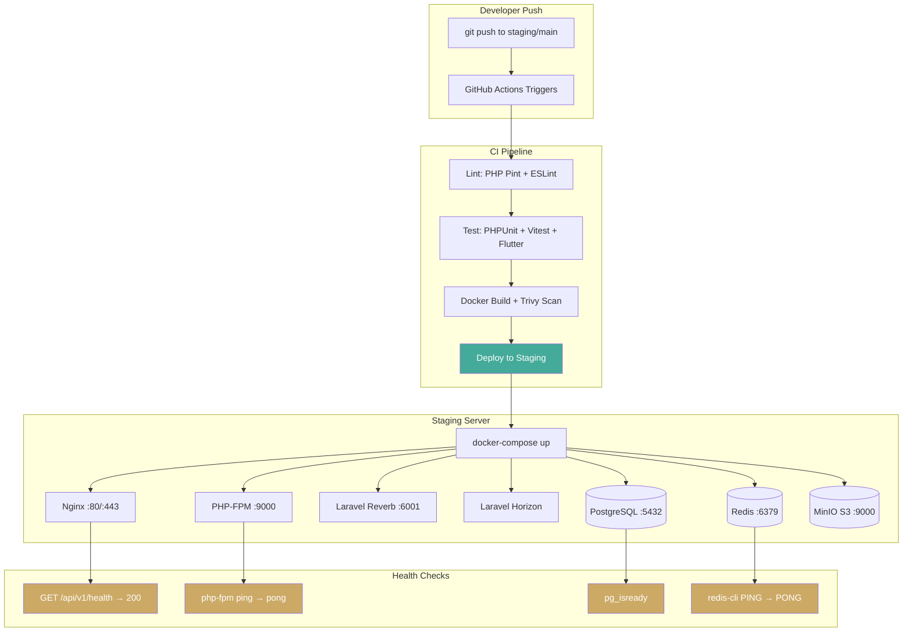

# STAGING PLAN — TaskSync Pro (SAAS-001)

> **Gate:** 6 · **Owner:** Barbara Jensen (sofi-qa-sre-lead) · **Date:** 2026-06-25
> **Handoff to:** sofi-devops-cloud-lead (TKT-014)
> **Status:** 🟡 Planned — infra files ready for CI provisioning

---

## 1. Docker Setup

### Architecture

```
┌─────────────────────────────────────────────────┐
│                  Docker Compose                  │
│                                                   │
│  ┌──────────┐  ┌──────────┐  ┌───────────────┐  │
│  │  Nginx    │  │  Reverb  │  │  Horizon       │  │
│  │  :80/443  │  │  :6001   │  │  (queue)      │  │
│  └────┬─────┘  └──────────┘  └───────────────┘  │
│       │                                           │
│  ┌────▼─────┐  ┌──────────┐  ┌───────────────┐  │
│  │ PHP-FPM  │  │  Node    │  │  PostgreSQL    │  │
│  │ Laravel  │  │  Vite    │  │  :5432         │  │
│  │ :9000    │  │  :5173   │  └───────────────┘  │
│  └──────────┘  └──────────┘                       │
│                    ┌──────────┐  ┌───────────────┐│
│                    │  Redis   │  │  MinIO (S3)   ││
│                    │  :6379   │  │  :9000        ││
│                    └──────────┘  └───────────────┘│
└─────────────────────────────────────────────────┘
```

### Container Images

| Service | Image | Source | Exposed Port |
|---------|-------|--------|-------------|
| **nginx** | `nginx:1.27-alpine` | Docker Hub | 80, 443 |
| **php-fpm** | `php:8.3-fpm-alpine` | Custom Dockerfile | 9000 |
| **node** | `node:20-alpine` | Custom Dockerfile (build stage) | — |
| **reverb** | Custom (php-fpm base) | Dockerfile entrypoint | 6001 |
| **horizon** | Custom (php-fpm base) | Dockerfile entrypoint | — |
| **postgres** | `postgres:16-alpine` | Docker Hub | 5432 |
| **redis** | `redis:7-alpine` | Docker Hub | 6379 |
| **minio** | `minio/minio:latest` | Docker Hub | 9000, 9001 |

### Dockerfiles

- `src/backend/Dockerfile` — Multi-stage: composer deps → PHP-FPM runtime + Reverb + Horizon
- `src/frontend/Dockerfile` — Multi-stage: npm ci → vite build → nginx serve

### Docker Compose Services

| Service | Depends On | Volumes | Health Check |
|---------|-----------|---------|-------------|
| postgres | — | `pgdata:/var/lib/postgresql/data` | `pg_isready` |
| redis | — | `redis:/data` | `redis-cli ping` |
| minio | — | `minio:/data` | `/minio/health/live` |
| php-fpm | postgres, redis, minio | `./src/backend:/var/www` | `php-fpm-healthcheck` |
| node-build | — | `node_modules`, `dist` ephemeral | — |
| nginx | php-fpm | `./src/frontend/dist:/var/www/html` | port 80 |
| reverb | php-fpm, redis | shares php-fpm volume | port 6001 |
| horizon | php-fpm, redis | shares php-fpm volume | — |

### Environment Variables (`.env.staging`)

See template: `projects/saas-100-ideas/01-productivity/SAAS-001/.env.staging`

---

## 2. CI/CD Pipeline (GitHub Actions)

### Workflow: `.github/workflows/ci.yml`

**Trigger:** push to `main`, `develop`, `staging` branches + PRs to `main`

**Pipeline Stages:**

```
┌──────────┐    ┌──────────┐    ┌───────────┐    ┌───────────┐    ┌───────────┐    ┌──────────┐
│  PHP Lint │───▶│ PHPUnit  │───▶│  Vitest   │───▶│  Flutter  │───▶│  Docker   │───▶│  Deploy  │
│           │    │  Tests   │    │  Tests    │    │  Analyze  │    │  Build +  │    │ Staging  │
│  Pint/PHP │    │  +       │    │  +        │    │  +        │    │  Trivy   │    │          │
│  Stan     │    │ Coverage │    │ Coverage  │    │  Test     │    │  Scan    │    │          │
└──────────┘    └──────────┘    └───────────┘    └───────────┘    └───────────┘    └──────────┘
```

| Stage | Runner | Tools | Timeout |
|-------|--------|-------|---------|
| Lint | ubuntu-latest | `pint`, `phpstan`, `eslint` | 5m |
| PHP Tests | ubuntu-latest | `phpunit` + SQLite | 10m |
| Frontend Tests | ubuntu-latest | `vitest`, `playwright` | 10m |
| Flutter Analyze | ubuntu-latest | `flutter analyze`, `flutter test` | 10m |
| Docker Build | ubuntu-latest | `docker build`, `trivy image` | 15m |
| Deploy Staging | ubuntu-latest | `docker compose`, `healthcheck` | 10m |

**Caching:** Composer vendor, npm `node_modules`, Flutter pub cache, Docker layers.

**Secrets required:**
- `DOCKER_USERNAME` / `DOCKER_PASSWORD` — Docker Hub push
- `STAGING_SSH_KEY` — SSH deploy key
- `STAGING_HOST` / `STAGING_USER` — SSH target
- `APP_KEY` — Laravel APP_KEY
- `POSTGRES_PASSWORD` — DB password

---

## 3. Staging Environment

### Services & Ports

| Service | Internal Port | External Port | Protocol |
|---------|--------------|---------------|----------|
| Nginx | 80 | 80 | HTTP |
| Nginx (HTTPS) | 443 | 443 | HTTPS |
| Reverb | 6001 | 6001 | WSS |
| PostgreSQL | 5432 | — (internal) | TCP |
| Redis | 6379 | — (internal) | TCP |
| MinIO API | 9000 | — (internal) | HTTP |
| MinIO Console | 9001 | — (internal) | HTTP |

### Health Check Endpoints

| Service | Endpoint | Expected |
|---------|----------|----------|
| Laravel | `GET /api/v1/health` | `{"status":"ok","timestamp":"..."}` |
| Nginx | `GET /nginx-health` | 200 |
| PostgreSQL | pg_isready | `accepting connections` |
| Redis | `redis-cli ping` | `PONG` |
| Reverb | WebSocket connect | 101 upgrade |
| Horizon | `GET /horizon/status` (admin) | `{"status":"active"}` |

### SSL (Let's Encrypt)

```
https://staging.tasksyncpro.com
```

**Setup:**
```bash
# Initial cert (run once on staging host)
docker compose run --rm certbot certonly \
  --webroot --webroot-path=/var/www/html \
  -d staging.tasksyncpro.com

# Auto-renewal via cron (daily check)
0 3 * * * docker compose run --rm certbot renew && docker compose exec nginx nginx -s reload
```

### Environment Template (`.env.staging`)

```
APP_NAME=TaskSyncPro
APP_ENV=staging
APP_DEBUG=true
APP_URL=https://staging.tasksyncpro.com

DB_CONNECTION=pgsql
DB_HOST=postgres
DB_PORT=5432
DB_DATABASE=tasksync
DB_USERNAME=tasksync
DB_PASSWORD=${POSTGRES_PASSWORD}

REDIS_HOST=redis
REDIS_PASSWORD=null
REDIS_PORT=6379

REVERB_APP_ID=staging-reverb
REVERB_APP_KEY=${REVERB_APP_KEY}
REVERB_APP_SECRET=${REVERB_APP_SECRET}
REVERB_HOST=0.0.0.0
REVERB_PORT=6001
REVERB_SCHEME=http

FILESYSTEM_DISK=s3
AWS_ACCESS_KEY_ID=${MINIO_ROOT_USER}
AWS_SECRET_ACCESS_KEY=${MINIO_ROOT_PASSWORD}
AWS_DEFAULT_REGION=us-east-1
AWS_BUCKET=tasksync-staging
AWS_ENDPOINT=http://minio:9000
AWS_USE_PATH_STYLE_ENDPOINT=true

MAIL_MAILER=smtp
MAIL_HOST=${MAIL_HOST}
MAIL_PORT=587
MAIL_USERNAME=${MAIL_USERNAME}
MAIL_PASSWORD=${MAIL_PASSWORD}
MAIL_ENCRYPTION=tls
MAIL_FROM_ADDRESS=noreply@tasksyncpro.com
MAIL_FROM_NAME="${APP_NAME}"

SESSION_DRIVER=redis
QUEUE_CONNECTION=redis
CACHE_STORE=redis

FCM_SERVER_KEY=${FCM_SERVER_KEY}
WHATSAPP_TOKEN=${WHATSAPP_TOKEN}
SLACK_WEBHOOK_URL=${SLACK_WEBHOOK_URL}
```

---

## 4. Deployment Script

### `deploy/staging/deploy.sh`

Automated zero-downtime deployment:

```bash
#!/usr/bin/env bash
set -euo pipefail

STAGING_DIR="/opt/tasksync"
BRANCH="${1:-main}"

echo "=== Deploying TaskSync Pro to staging (branch: $BRANCH) ==="

# 1. Git pull
cd "$STAGING_DIR"
git fetch origin "$BRANCH"
git reset --hard "origin/$BRANCH"

# 2. Build frontend
echo "--- Building frontend ---"
docker compose run --rm node-build npm ci
docker compose run --rm node-build npm run build

# 3. Build backend
echo "--- Building backend ---"
docker compose build php-fpm

# 4. Start dependent services
echo "--- Starting infrastructure ---"
docker compose up -d postgres redis minio

# 5. Wait for DB
echo "--- Waiting for PostgreSQL ---"
until docker compose exec -T postgres pg_isready -U tasksync; do
  sleep 2
done

# 6. Run migrations
echo "--- Running migrations ---"
docker compose run --rm php-fpm php artisan migrate --force

# 7. Start app services
echo "--- Starting app services ---"
docker compose up -d php-fpm nginx reverb horizon

# 8. Health check
echo "--- Health check ---"
for i in {1..12}; do
  STATUS=$(curl -s -o /dev/null -w "%{http_code}" http://localhost/api/v1/health 2>/dev/null || echo "000")
  if [ "$STATUS" = "200" ]; then
    echo "✅ Health check passed"
    break
  fi
  echo "  Waiting... ($i/12)"
  sleep 5
done

if [ "$STATUS" != "200" ]; then
  echo "❌ Health check failed — rolling back"
  docker compose stop nginx php-fpm reverb horizon
  docker compose up -d nginx php-fpm reverb horizon
  exit 1
fi

# 9. Clear cache
echo "--- Clearing cache ---"
docker compose run --rm php-fpm php artisan optimize:clear

echo "=== ✅ Deployment complete ==="
```

---

## 5. Rollback Plan

```bash
# Quick rollback to previous release
cd /opt/tasksync
git revert HEAD --no-edit
docker compose build php-fpm
docker compose up -d php-fpm nginx reverb horizon
# If DB migration broke: restore DB snapshot
docker compose exec -T postgres pg_restore -U tasksync -d tasksync /backups/pre-deploy.dump
```

### Pre-deploy Backup

```bash
docker compose exec -T postgres pg_dump -U tasksync tasksync > /backups/pre-deploy-$(date +%Y%m%d-%H%M).sql
```

---

## 6. Monitoring & Logs

| Service | Log Access | Tool |
|---------|-----------|------|
| Laravel | `docker compose logs php-fpm` | Laravel Telescope (staging) |
| Nginx | `docker compose logs nginx` | `docker compose logs` |
| PostgreSQL | `docker compose logs postgres` | `docker compose logs` |
| Redis | `docker compose logs redis` | `docker compose logs` |
| Reverb | `docker compose logs reverb` | `docker compose logs` |
| Horizon | `docker compose logs horizon` | Horizon dashboard |

---

## 7. CI/CD Pipeline Stages Detail

### Environment Matrix

| Stage | Runs On | Cache | Dependencies |
|-------|---------|-------|-------------|
| `lint-php` | ubuntu-latest | Composer | PHP 8.3 |
| `lint-frontend` | ubuntu-latest | npm | Node 20 |
| `phpunit` | ubuntu-latest | Composer | SQLite |
| `vitest` | ubuntu-latest | npm | Playwright |
| `flutter-analyze` | ubuntu-latest | pub | Flutter 3.24 |
| `trivy-scan` | ubuntu-latest | — | Trivy |
| `deploy-staging` | ubuntu-latest | Docker | SSH key |

### Failure Handling

- **Any lint failure** → ❌ Block PR merge, notify in PR comment
- **Test failure** → ❌ Block deploy; auto-create GitHub issue with failure details
- **Trivy Critical/High** → ❌ Block deploy; create security incident ticket
- **Deploy health check fail** → 🔄 Auto-rollback to previous commit, notify Slack

---

## 8. Infrastructure as Code Checklist

| Item | Status | File |
|------|--------|------|
| Backend Dockerfile | ✅ Written | `src/backend/Dockerfile` |
| Frontend Dockerfile | ✅ Written | `src/frontend/Dockerfile` |
| docker-compose.yml | ✅ Written | `src/docker-compose.yml` |
| CI/CD workflow | ✅ Written | `.github/workflows/ci.yml` |
| .env.staging template | ✅ Written | `.env.staging` |
| Deploy script | ✅ Written | `deploy/staging/deploy.sh` |
| Health check route | ⏳ Backend implementation | `routes/api.php` |
| SSL cert bootstrap | 📋 Manual step | Certbot |
| Monitoring config | 📋 Post-deploy | Telescope/Horizon |

---

## 9. Infrastructure Diagram



---

*Generated by Barbara "Barb" Jensen · sofi-qa-sre-lead · Gate 6 Staging Plan · 2026-06-25*
*Next: sofi-devops-cloud-lead (TKT-014) — implement + provision*
