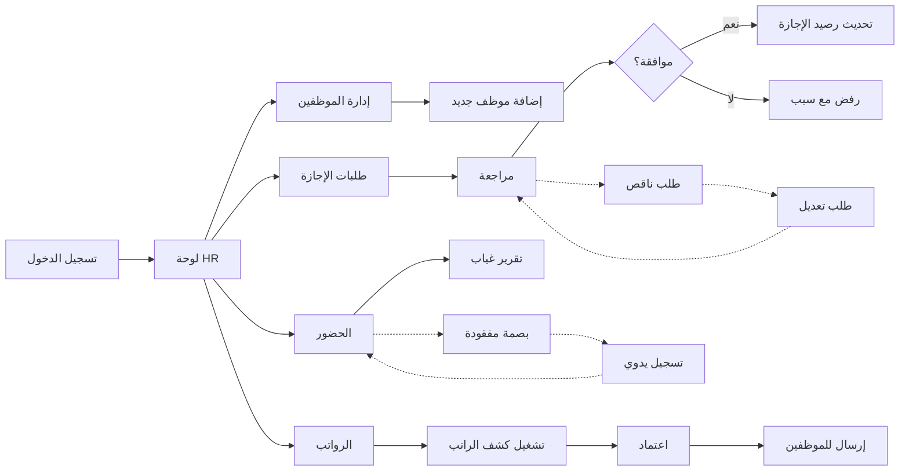

# JOURNEY MAP — HRTide (SAAS-023)
> Owner: Journey Architect · Gate 1 · Persona: فاطمة (مديرة HR)

## Flow (Mermaid)

## Stage Annotations
| Stage | User Action | Goal | Emotion | Friction | Screen |
|-------|-------------|------|---------|----------|--------|
| لوحة | نظرة على المؤشرات | معرفة المهام اليوم | 😊 | أرقام كثيرة بدون سياق | Dashboard |
| موظفين | إضافة/تعديل موظف | تحديث قاعدة البيانات | 😐 | حقول كثيرة إجبارية | Employees |
| إجازات | مراجعة طلب إجازة | موافقة أو رفض | 😐 | كثير طلبات متزامنة | Leaves |
| حضور | مراقبة الغياب | متابعة الانضباط | 😊 | البصمة QR لا تعمل | Attendance |
| رواتب | تشغيل الراتب | صرف الرواتب بدقة | 😰 | حسابات الخصم معقدة | Payroll |
| تقييم | تقييم أداء | تحسين الإنتاجية | 😐 | الموظفون لا يتفاعلون | Reviews |

## Ranked Friction Log
1. [High] حقول كثيرة عند إضافة موظف → معالج خطوات بتصميم بسيط
2. [High] حسابات الرواتب معقدة → نموذج راتب بسيط (أساسي + بدلات + خصوم)
3. [Med] طلبات إجازة متزامنة → Batch approval + رؤية تقويم الإجازات
4. [Med] البصمة QR لا تعمل → GPS check-in بديل
5. [Low] الموظفون لا يتفاعلون مع التقييم → تصميم gamified + تذكير

**Rule:** Every later feature MUST trace to a stage above.
