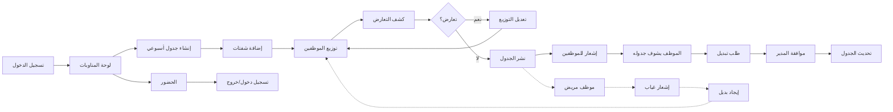

# JOURNEY MAP — ShiftMaster (SAAS-027)
> Owner: Journey Architect · Gate 1 · Persona: ناصر (مدير مطعم)

## Flow (Mermaid)

## Stage Annotations
| Stage | User Action | Goal | Emotion | Friction | Screen |
|-------|-------------|------|---------|----------|--------|
| إنشاء | إضافة شفتات للمناوبات | جدولة كاملة | 😐 | واجهة التقويم مزدحمة | Schedule |
| توزيع | توزيع الموظفين على الشفتات | تغطية كل الشفتات | 😊 | سحب وإفلات بطيء مع 20 موظف | Assign |
| نشر | نشر الجدول | إعلام الجميع | 😊 | بعض الموظفين ما يشوفون الإشعار | Publish |
| عرض | الموظف يشوف جدوله | معرفة الدوام | 😊 | الجدول يتغير بعد النشر | My Schedule |
| تبديل | طلب تبديل شفت | مرونة | 😐 | المدير يتأخر في الموافقة | Swap |
| حضور | تسجيل الدخول | توقيت دقيق | 😊 | GPS يقرأ موقع خاطئ | Clock In |

## Ranked Friction Log
1. [High] سحب وإفلات بطيء مع 20+ موظف → تحسين أداء drag-drop + search assign
2. [High] الجدول يتغير بعد النشر → Version history + إشعار بالتغيير
3. [Med] الموظف ما يشوف الإشعار → Push + SMS backup
4. [Med] GPS يقرأ موقع خاطئ → QR check-in بديل + يدوي
5. [Low] كشف التعارض بطيء → auto-detect مع عناوين واضحة

**Rule:** Every later feature MUST trace to a stage above.
