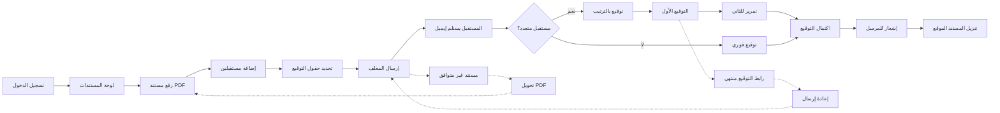

# JOURNEY MAP — DocuSign Pro (SAAS-029)
> Owner: Journey Architect · Gate 1 · Persona: تركي (محامٍ)

## Flow (Mermaid)

## Stage Annotations
| Stage | User Action | Goal | Emotion | Friction | Screen |
|-------|-------------|------|---------|----------|--------|
| رفع | رفع المستند | إضافته للنظام | 😐 | رفع PDF كبير بطيء | Upload |
| حقول | سحب حقول التوقيع | تحديد موقعه | 😐 | الحقول لا تظهر بالعربية | Fields |
| إرسال | إرسال للتوقيع | بدء العملية | 😊 | الإيميل يذهب للـ Spam | Send |
| توقيع | الموقّع يوقع | إتمام العقد | 😊 | واجهة التوقيع لا تدعم اللمس | Sign |
| متابعة | تتبع الحالة | معرفة أين وصل | 😊 | بطء تحديث الحالة | Tracking |
| تنزيل | تحميل المستند الموقع | أرشفة | 😊 | المستند الموقّع حجمه كبير | Download |

## Ranked Friction Log
1. [High] رفع PDF كبير (>10MB) بطيء → معالجة خلفية + شريط تقدم
2. [High] الإيميل يذهب للـ Spam → تكامل SPF/DKIM + إشعار بديل SMS
3. [Med] حقول التوقيع لا تظهر بالعربية → RTL detection + حقول عربية تلقائية
4. [Med] رابط التوقيع ينتهي → صلاحية 7 أيام + إعادة إرسال بنقرة
5. [Low] المستند الموقّع كبير للتنزيل → ضغط PDF + رابط مباشر

**Rule:** Every later feature MUST trace to a stage above.
