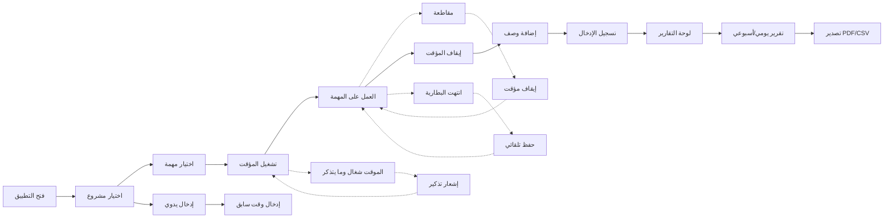

# JOURNEY MAP — TimeSheet Pro (SAAS-030)
> Owner: Journey Architect · Gate 1 · Persona: أحمد (مطور)

## Flow (Mermaid)

## Stage Annotations
| Stage | User Action | Goal | Emotion | Friction | Screen |
|-------|-------------|------|---------|----------|--------|
| تشغيل | يضغط زر Start | بدء التسجيل | 😊 | ينسى اختيار المهمة أولاً | Timer |
| عمل | يعمل على المهمة | إنجاز العمل | 😊 | المقاطعات توقف التركيز | Working |
| إيقاف | يضغط Stop | إنهاء التسجيل | 😊 | يوقف المؤقت بالغلط | Timer Stop |
| وصف | يضيف وصفاً | توثيق العمل | 😐 | يكتب وصفاً مختصراً جداً | Description |
| تقرير | يعرض ساعاته | معرفة الإنتاجية | 😊 | التقرير يظهر ساعات غير متوقعة | Reports |
| تصدير | يصدر PDF | إرسال للعميل | 😊 | تنسيق PDF لا يرضي العميل | Export |

## Ranked Friction Log
1. [High] ينسى اختيار المهمة قبل التشغيل → auto-select آخر مهمة + قائمة سريعة
2. [High] المقاطعات توقف التركيز → زر "استئناف" بعد المقاطعة + تسجيل المقاطعات
3. [Med] يوقف المؤقت بالغلط → تأكيد قبل الإيقاف + undo في 5 ثوان
4. [Med] التقرير يظهر ساعات غير متوقعة → تقارير مع مقارنة المخطط vs الفعلي
5. [Low] تنسيق PDF لا يرضي العميل → قوالب PDF احترافية مع شعار الشركة

**Rule:** Every later feature MUST trace to a stage above.
