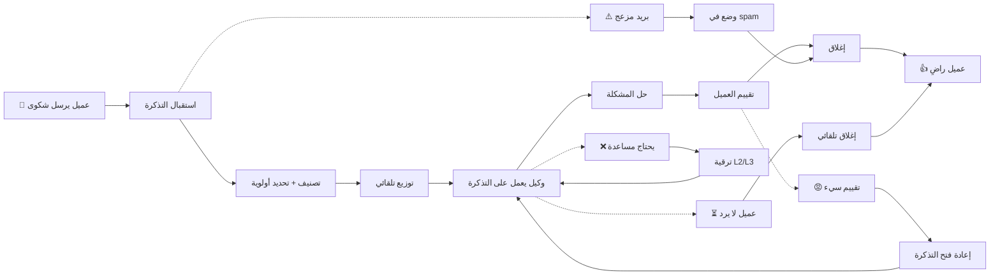

# JOURNEY MAP — SupportDesk (SAAS-033)
> Owner: Journey Architect · Gate 1 · Persona: نور (مديرة دعم)

## Flow (Mermaid)

## Stage Annotations
| Stage | User Action | Goal | Emotion | Friction | Screen |
|-------|-------------|------|---------|----------|--------|
| Trigger | عميل يرسل شكوى | حل المشكلة | 😠 غاضب | — | — |
| Intake | النظام يستقبل التذكرة | تسجيل فوري | 😐 محايد | — | Ticket Queue |
| Classify | تصنيف تلقائي حسب الموضوع | توجيه صحيح | 🤔 قلق | تصنيف خاطئ أحياناً | Auto-classify |
| Auto-assign | توزيع على الوكيل المناسب | توزيع عادل | 😊 راضٍ | — | Assignment Logic |
| Agent Work | وكيل يحقق ويحل | حل المشكلة | 😐 مركز | معلومات ناقصة من العميل | Ticket Detail |
| Resolve | يرسل الحل للعميل | إغلاق التذكرة | 🙂 راضٍ | — | Resolve Flow |
| Review | عميل يقيم الحل | تقييم التجربة | 😐 عادي | — | CSAT Form |
| Close | إغلاق وإحصاءات | توثيق | 😊 راضٍ | — | Ticket Archive |

## Ranked Friction Log
1. **[High]** التصنيف والتوزيع اليدوي يستغرق وقتاً — يحتاج توزيع ذكي تلقائي
2. **[High]** الوكيل يبحث عن حلول للتذاكر المتكررة — يحتاج قاعدة معرفة + ردود جاهزة
3. **[Med]** صعوبة متابعة أداء الفريق — يحتاج لوحة أداء آنية
4. **[Med]** العميل لا يرد على استفسارات المتابعة — يحتاج إشعارات تلقائية
5. **[Low]** التقارير الأسبوعية تستغرق وقتاً — يحتاج تقارير آلية

**Rule:** Every later feature MUST trace to a stage above.
