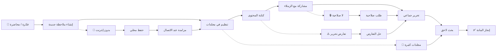

# JOURNEY MAP — NoteSpace (SAAS-036)
> Owner: Journey Architect · Gate 1 · Persona: سلمى (طالبة)

## Flow (Mermaid)

## Stage Annotations
| Stage | User Action | Goal | Emotion | Friction | Screen |
|-------|-------------|------|---------|----------|--------|
| Trigger | سلمى تريد تدوين محاضرة | بدء الملاحظة | 😊 نشيطة | — | — |
| Create Note | تنقر زر "ملاحظة جديدة" | فتح محرر | 🙂 سريع | — | Empty editor |
| Organize | تختار المجلد والوسوم | تنظيم المحتوى | 😐 عادي | مجلدات كثيرة | Folder Tree |
| Write | تكتب المحتوى بالعربية | توثيق المادة | 😊 منتجة | تنسيق RTL | Rich Text Editor |
| Collaborate | تشارك مع زميلاتها | تعاون | 😊 متعاونة | — | Share Dialog |
| Edit | زميلاتها يعدلن آنياً | تحسين الملاحظات | 🙂 سعيد | تعارضات | Collaborative Edit |
| Search | تبحث عن معلومة قديمة | إيجاد سريع | 😐 قلق | كلمات مفتاحية غير دقيقة | Search Results |
| Goal | تستعد للامتحان | مراجعة | 😃 جاهزة | — | — |

## Ranked Friction Log
1. **[High]** RTL غير مدعوم كافياً في المحررات — دعم كامل للغة العربية والكتابة من اليمين
2. **[High]** فقدان الملاحظات — حفظ تلقائي + مزامنة سحابية
3. **[Med]** تعارض التحرير التعاوني — CRDT / OT مع حل بسيط
4. **[Med]** صعوبة البحث في الكم الكبير من الملاحظات — بحث كامل النص مع اقتراحات
5. **[Low]** مشاركة الفريق تحتاج إدارة صلاحيات — صلاحيات مشاهدة/تعديل لكل ملاحظة

**Rule:** Every later feature MUST trace to a stage above.
