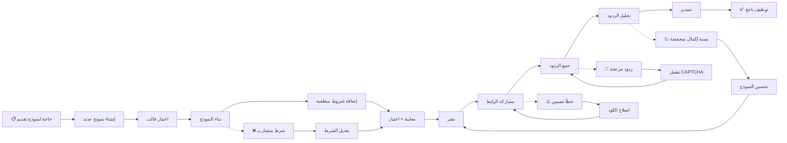

# JOURNEY MAP — FormBuilder (SAAS-039)
> Owner: Journey Architect · Gate 1 · Persona: هند (مسؤولة توظيف)

## Flow (Mermaid)

## Stage Annotations
| Stage | User Action | Goal | Emotion | Friction | Screen |
|-------|-------------|------|---------|----------|--------|
| Trigger | هند تريد نموذج تقديم جديد | بدء الإنشاء | 🙂 جاهزة | — | — |
| Create | تختار قالباً أو تبدأ فارغاً | إطار عمل | 😐 عادي | — | Form List |
| Choose Template | تتصفح القوالب المتاحة | توفير وقت | 😊 سريعة | — | Template Gallery |
| Build | تسحب العناصر للوحة | تصميم النموذج | 😊 منتجة | — | Form Builder |
| Conditions | تضيف قواعد If/Then | تخصيص ديناميكي | 🤔 مركزة | تعارضات محتملة | Condition Builder |
| Preview | تختبر النموذج كمتقدم | تأكيد الصحة | 😐 قلق | أخطاء منطقية | Preview |
| Publish | تنشر النموذج | إتاحته | 😊 راضية | — | Publish Dialog |
| Share | تنسخ الرابط أو تضمّن | توزيع | 🙂 سريعة | — | Share |
| Collect | تراقب الردود | متابعة | 😐 عادي | — | Submissions |
| Analyze | تحلل الردود والرسوم البيانية | استخلاص النتائج | 🤔 مركزة | — | Analytics |
| Goal | توظيف المرشح المناسب | نجاح | 😃 سعيدة | — | — |

## Ranked Friction Log
1. **[High]** الشروط المنطقية معقدة في الأدوات الحالية — واجهة بصرية لقواعد If/Then مع AND/OR
2. **[High]** لا توجد رؤية للردود في مكان واحد — لوحة ردود مركزية مع فلترة
3. **[Med]** إكمال النموذج منخفض — تحسين تجربة المستخدم + شريط تقدم
4. **[Med]** الردود المزعجة — CAPTCHA + حقل honeypot
5. **[Low]** تصدير النتائج ممل — CSV/Excel/PDF بنقرة زر

**Rule:** Every later feature MUST trace to a stage above.
