# JOURNEY MAP — WikiBase (SAAS-040)
> Owner: Journey Architect · Gate 1 · Persona: طارق (مدير تقني)

## Flow (Mermaid)

```mermaid
flowchart LR
  trigger["📄 سياسة أمنية جديدة"] --> create_page["إنشاء صفحة"]
  create_page --> organize["تنظيم في مساحة/تصنيف"]
  organize --> write["كتابة المحتوى"]
  write --> link["إضافة وصلات داخلية"]
  link --> permissions["تحديد الصلاحيات"]
  permissions --> publish["نشر"]
  publish --> search["بحث لاحق"]
  search --> find["العثور على الصفحة"]
  find --> update["تحديث المحتوى"]
  update --> goal["🧠 معرفة مؤسسية"]
  write -.-> draft["⏸️ حفظ كمسودة"]
  draft --> publish
  search -.-> not_found["🔍 لا نتائج"]
  not_found --> create_page
  update -.-> version["📝 حفظ إصدار"]
  version --> history["عرض الإصدارات"]
  history --> diff["مقارنة التغييرات"]
  diff --> goal
  permissions -.-> restrict["🔒 لا صلاحية"]
  restrict --> request_access["طلب صلاحية"]
  request_access --> search
```

## Stage Annotations
| Stage | User Action | Goal | Emotion | Friction | Screen |
|-------|-------------|------|---------|----------|--------|
| Trigger | طارق يحتاج توثيق سياسة | بدء التوثيق | 😐 محايد | — | — |
| Create Page | ينشئ صفحة جديدة | مساحة للكتابة | 🙂 جاهز | — | Page Editor |
| Organize | يختار المساحة والتصنيف | تنظيم هرمي | 😐 عادي | هيكل المساحات | Page Tree |
| Write | يكتب المحتوى بالعربية | توثيق | 😊 منتج | — | WYSIWYG Editor |
| Link | يضيف روابط لصفحات أخرى | ربط المعرفة | 🙂 مركز | البحث عن الصفحات المرتبطة | Link Picker |
| Permissions | يحدد من يمكنه المشاهدة | أمان | 😐 عادي | — | Permission Modal |
| Publish | ينشر الصفحة | إتاحة | 😊 راضٍ | — | — |
| Search | زميل يبحث عن السياسة | إيجاد | 🤔 قلق | الكلمة المفتاحية مختلفة | Search |
| Find | يجد الصفحة بسرعة | وصول | 😃 راضٍ | — | Search Results |
| Update | يعدل المحتوى | تحديث | 🙂 سريع | — | Editor |
| Goal | المعرفة متاحة للجميع | مؤسسة متعلمة | 😃 سعيد | — | — |

## Ranked Friction Log
1. **[High]** المعرفة متناثرة — مركزية كل المحتوى في WikiBase
2. **[High]** البحث بالعربية ضعيف في الأدوات الحالية — Arabic stemming + بحث كامل النص
3. **[High]** لا ربط بين المستندات — وصلات داخلية + باكلنكس تلقائية
4. **[Med]** الموظفون يغادرون والمعرفة ترحل — توثيق إجباري + سجل إصدارات
5. **[Med]** صلاحيات غير دقيقة — تحكم على مستوى الصفحة والمساحة

**Rule:** Every later feature MUST trace to a stage above.
