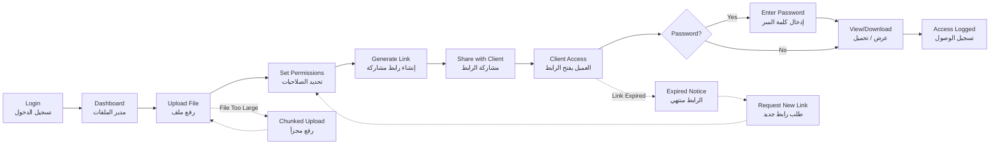

# JOURNEY MAP — FileVault (SAAS-043)
> Owner: Journey Architect · Gate 1 · Persona: مريم (محامية)

## Flow (Mermaid)

## Stage Annotations
| Stage | User Action | Goal | Emotion | Friction | Screen |
|-------|-------------|------|---------|----------|--------|
| Upload | يسحب ملفاً أو يختار من الجهاز | رفع سريع | 😊 سهل | الملفات الكبيرة تتعطل | File Manager |
| Permissions | يختار صلاحيات (view/download) | تحكم دقيق | 🤔 مركز | خيارات كثيرة تربك المستخدم | Share Dialog |
| Share Link | ينسخ الرابط ويرسله | مشاركة آمنة | 😌 راضٍ | نسخ الرابط غير واضح | Share Dialog |
| Client Access | العميل يفتح الرابط | استلام الملف | 😊 سهل | يحتاج كلمة سر نسيت | Public View |
| Access Log | يرى سجل الوصول | تتبع الاستخدام | ✅ مرتاح | المعلومات قليلة جداً | Access Logs |
| Revoke | يلغي الرابط | إبطال فوري | 😤 إحباط (لأنه ضروري) | صعوبة إيجاد رابط الإبطال | Share Dialog |

## Ranked Friction Log
1. [High] الملفات الكبيرة تفشل في الرفع (لا توجد علامة تقدم)
2. [High] العملاء ينسون كلمة سر الرابط
3. [Med] إيجاد رابط للإبطال صعب
4. [Med] لا توجد معاينة قبل التحميل
5. [Low] لا يوجد إشعار عند تحميل العميل للملف
