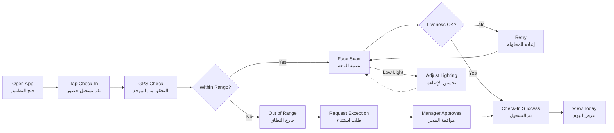

# JOURNEY MAP — StampMe (SAAS-046)
> Owner: Journey Architect · Gate 1 · Persona: سارة (مديرة HR)

## Flow (Mermaid)

## Stage Annotations
| Stage | User Action | Goal | Emotion | Friction | Screen |
|-------|-------------|------|---------|----------|--------|
| Open | يفتح التطبيق | الوصول السريع | 😊 سهل | التطبيق بطيء في الفتح | Home |
| Check-In | ينقر زر الحضور الكبير | تسجيل سريع | 🤔 مركز | الزر صغير | Home |
| GPS | الموقع يتحقق تلقائياً | تأكيد الموقع | 😐 محايد | GPS لا يعمل داخل المصنع | Verification |
| Face Scan | يوجه وجهه للكاميرا | التحقق من الهوية | 😰 قلق | الإضاءة ضعيفة | Face Scan |
| Success | يرى تأكيد الحضور | راحة | 😌 ارتياح | لا يوجد صوت تأكيد | Success |
| Report | المديرة تطلع على التقرير | متابعة الحضور | ✅ راضية | الأسماء غير مرتبة | Reports |

## Ranked Friction Log
1. [High] GPS لا يعمل داخل المباني الخرسانية (المصانع)
2. [High] بصمة الوجه تفشل في الإضاءة المنخفضة
3. [Med] التطبيق بطيء في فتح الكاميرا
4. [Med] لا توجد إشعارات تذكير بالحضور
5. [Low] العمال لا يمتلكون إنترنت جيد (يحتاج وضع أوفلاين)
