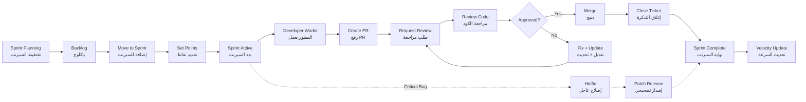

# JOURNEY MAP — DevSync (SAAS-050)
> Owner: Journey Architect · Gate 1 · Persona: يوسف (Tech Lead)

## Flow (Mermaid)

## Stage Annotations
| Stage | User Action | Goal | Emotion | Friction | Screen |
|-------|-------------|------|---------|----------|--------|
| Sprint Planning | يسحب تذاكر من الباكلوج | بناء السبرنت | 🤔 مركز | تقدير النقاط غير دقيق | Sprint Board |
| Develop | يبرمج ويحدث الحالة | إنجاز المهام | 🧐 مركز | ينسى تحديث الحالة | Ticket Detail |
| Create PR | يرفع PR مرتبط بالتذكرة | دمج الكود | 😊 راضٍ | لصق رابط PR يدوياً | PR Link |
| Review | يراجع كود زميله | ضمان الجودة | 🤔 مركز | الـ diff صعب القراءة في الشاشة الصغيرة | Code Review |
| Merge | يوافق على الدمج | إنهاء المهمة | ✅ راضٍ | الـ merge يتعارض مع الـ main | PR Detail |
| Retro | يحلل السرعة | تحسين العملية | 😤 محبط (إذا السرعة نزلت) | التحليلات لا تظهر أسباب التراجع | Analytics |

## Ranked Friction Log
1. [High] تقدير النقاط غير دقيق — الفريق يبالغ أو يقلل
2. [High] صعوبة ربط PR يدوياً بالتذكرة (ينسى المطور)
3. [Med] الـ diff view صعب القراءة في شاشة الجوال
4. [Med] ينسى المطور تحديث حالة التذكرة (In Progress → Done)
5. [Low] السبرنت لا يغلق تلقائياً عند انتهاء التاريخ
