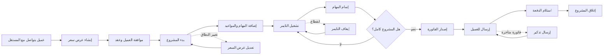

# JOURNEY MAP — FreelanceHub (SAAS-064)
> Owner: Journey Architect · Gate 1 · Persona: عمر — مطور مستقل

## Flow (Mermaid)

## Stage Annotations
| Stage | User Action | Goal | Emotion | Friction | Screen |
|-------|-------------|------|---------|----------|--------|
| التواصل | الرد على استفسار العميل | فهم المتطلبات | 😊 متفائل | الرسائل تتوزع على عدة منصات | — |
| عرض السعر | إرسال Proposal | إقناع العميل | 🤔 مركز | بناء عرض سعر يستغرق وقتاً | Proposal Builder |
| التعاقد | إرسال العقد | توثيق الاتفاق | 😐 محايد | لا توجد قوالب جاهزة | Contract |
| بدء المشروع | إضافة المشروع والعميل | انطلاق العمل | 😌 واثق | إدخال بيانات متكرر | Create Project |
| تتبع الوقت | تشغيل التايمر عند البدء | تسجيل دقيق | 😊 منجز | النسيان في تشغيل التايمر | Time Tracker |
| إنجاز المهام | تحديث حالة المهام | تتبع التقدم | 😌 راضٍ | تحديث المهام يدوياً | Task Board |
| الفاتورة | إصدار وإرسال | الحصول على الدفعة | 😊 متفائل | حساب الضريبة والتسعير | Invoice |
| الدفع | استلام الدفعة | إغلاق الدورة | 😃 سعيد | تأخر الدفع أحياناً | Payment |

## Ranked Friction Log
1. [High] تأخر الدفعات — 30% من الفواتير تتأخر عن تاريخ الاستحقاق
2. [High] نسيان تشغيل التايمر — يخسر 5-10 ساعات غير مدفوعة شهرياً
3. [Med] إدارة العملاء بدون نظام — يصعب تتبع تاريخ التعامل
4. [Med] إعداد عروض الأسعار من الصفر — مضيعة للوقت
5. [Low] حساب الضريبة — يخطئ أحياناً في النسبة
6. [Low] لا توجد تقارير ربحية — لا يعرف هل المشروع مربح فعلاً

**Rule:** Every later feature MUST trace to a stage above.
