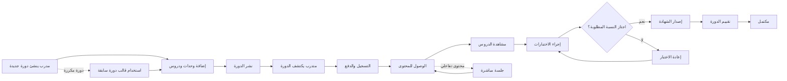

# JOURNEY MAP — CoachingPro (SAAS-068)
> Owner: Journey Architect · Gate 1 · Persona: د. أحمد — مدرب محترف

## Flow (Mermaid)

## Stage Annotations
| Stage | User Action | Goal | Emotion | Friction | Screen |
|-------|-------------|------|---------|----------|--------|
| إنشاء الدورة | إضافة وحدات ومحتوى | بناء منهج متكامل | 😊 متحمس | تنظيم المحتوى يستغرق وقتاً | Course Builder |
| نشر الدورة | ضبط السعر والإعدادات | جذب المتدربين | 😐 محايد | تحديد السعر المناسب صعب | Publish Settings |
| اكتشاف الدورة | متدرب يتصفح ويقارن | إيجاد الدورة المناسبة | 🤔 مهتم | مقارنة الدورات صعبة | Course Catalog |
| التسجيل | إتمام عملية الدفع | بدء الرحلة التعليمية | 😊 متفائل | عملية الدفع قد تفشل | Checkout |
| التعلم | مشاهدة الدروس وإتمامها | اكتساب المهارات | 😌 منجز | عدم الانضباط في التعلم الذاتي | Lesson Player |
| الاختبار | حل الأسئلة | تقييم الفهم | 😓 مجهد | صعوبة بعض الأسئلة | Quiz |
| الشهادة | استلام الشهادة | توثيق الإنجاز | 😃 فخور | الشهادة تتأخر أحياناً | Certificate |
| التقييم | تقييم الدورة | مشاركة الرأي | 😐 محايد | المتدربون لا يقيمون غالباً | Review |

## Ranked Friction Log
1. [High] إدارة المتدربين يدوياً — 5+ ساعات أسبوعياً في متابعة التسجيلات
2. [High] إصدار الشهادات — كل شهادة تحتاج 10 دقائق لإعدادها وتصميمها
3. [Med] عملية الدفع — التحويلات البنكية تتأخر 3-5 أيام
4. [Med] تقدم المتدربين — صعوبة متابعة من يتخلف عن الدروس
5. [Low] تقييم الجودة — لا توجد معايير واضحة لجودة التدريب
6. [Low] تسويق الدورات — قنوات متفرقة ونتائج محدودة

**Rule:** Every later feature MUST trace to a stage above.
