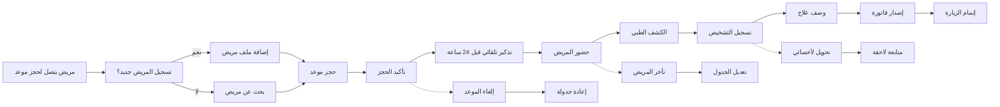

# JOURNEY MAP — ClinicFlow (SAAS-002)
> Owner: Journey Architect · Gate 1 · Persona: د. ليلى — طبيبة أسنان

## المسار (Mermaid)

## تعليقات المراحل
| المرحلة | إجراء المستخدم | الهدف | المشاعر | الاحتكاك | الشاشة |
|----------|----------------|-------|---------|----------|--------|
| حجز موعد | مساعدة تدخل بيانات المريض والتاريخ | حجز سريع | 😐 محايد | بطء البحث في الملفات الورقية | New Appointment |
| تذكير | النظام يرسل تذكير واتساب | تأكيد الحضور | 😊 مطمئن | أرقام هواتف خاطئة | (تلقائي) |
| حضور المريض | المريض يصل للعيادة | تسجيل الوصول | 🙂 عادي | تأخر المريض عن الموعد | Check-in |
| الكشف الطبي | طبيب يفحص المريض ويسجل | تشخيص دقيق | 😐 مركز | ضغط الوقت | SOAP Note |
| الفاتورة | كاشير يصدر فاتورة | تحصيل الإيراد | 😊 راض | نزاعات التأمين | Invoice |

## سجل الاحتكاك المرتب
1. [High] تخلف المرضى عن المواعيد (no-show 30%) → حل: تذكير ذكي قبل 24 ساعة وساعة (Screen 1)
2. [High] فقدان السجلات الورقية → حل: EMR سحابي مع بحث فوري (Screen 3)
3. [Med] صعوبة إيجاد ملفات المرضى بسرعة → حل: بحث باسم أو هاتف أو رقم ملف (Screen 2)
4. [Med] ازدواجية الحجز على نفس الوقت → حل: التحقق الآلي من تعارض المواعيد (Screen 1)
5. [Low] إصدار الفواتير اليدوي → حل: فواتير إلكترونية تلقائية (Screen 4)
