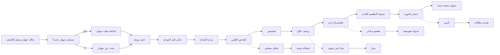

# JOURNEY MAP — PetCare Vet (SAAS-009)
> Owner: Journey Architect · Gate 1 · Persona: د. فارس — طبيب بيطري

## المسار (Mermaid)

## تعليقات المراحل
| المرحلة | إجراء المستخدم | الهدف | المشاعر | الاحتكاك | الشاشة |
|----------|----------------|-------|---------|----------|--------|
| تسجيل حيوان | إدخال بيانات الحيوان والمالك | إنشاء ملف | 🙂 راض | إدخال بيانات كثيرة | Pet Registration |
| حجز موعد | اختيار التاريخ والطبيب | حجز الكشف | 😊 مطمئن | مواعيد مزدحمة | Appointment |
| الفحص الطبي | تسجيل الأعراض والتشخيص | تشخيص دقيق | 😐 مركز | ضغط الوقت | SOAP Note |
| تطعيم | إعطاء التطعيم وتسجيله | حماية الحيوان | 😊 راض | جدول التطعيمات معقد | Vaccination |
| فاتورة | إصدار فاتورة للخدمات | تحصيل الإيراد | 😐 محايد | نزاعات الأسعار | Invoice |

## سجل الاحتكاك المرتب
1. [High] نسيان مواعيد التطعيم → حل: جدول تطعيمات تلقائي + تذكير (Screen 4)
2. [High] صعوبة إيجاد ملفات قديمة → حل: بحث متقدم باسم/نوع/مالك (Screen 2)
3. [Med] إدخال بيانات حيوان جديد مستهلك → حل: مسح سريع + حقل وزن تلقائي (Screen 1)
4. [Med] تذكير الملاك يدوياً → حل: تذكير واتساب تلقائي (تلقائي)
5. [Low] إدارة المخزون الدوائي → حل: مخزون مع حد أدنى (Screen 6)
