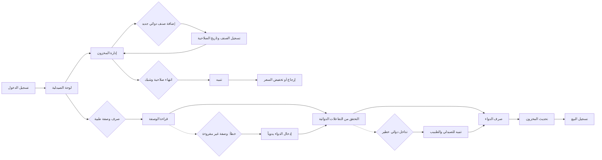

# JOURNEY MAP — PharmaStock (SAAS-018)
> Owner: Journey Architect · Gate 1 · Persona: د. هاشم القرشي

## Flow (Mermaid)

## Stage Annotations
| Stage | User Action | Goal | Emotion | Friction | Screen |
|-------|-------------|------|---------|----------|--------|
| لوحة الصيدلية | عرض المخزون المنخفض والوصفات المعلقة | نظرة سريعة | محايدة | كثرة التنبيهات | شاشة لوحة التحكم |
| صرف وصفة | إدخال الدواء والجرعة الموصوفة | معالجة الوصفة | إيجابية | صعوبة قراءة خط الطبيب | شاشة صرف وصفة |
| التحقق من التفاعلات | فحص تفاعلات الدواء مع أدوية المريض | ضمان السلامة | إيجابية | معلومات ناقصة عن تاريخ المريض الدوائي | شاشة التفاعلات |
| صرف الدواء | اختيار البديل المتاح (أصلي/جنيس) | صرف الدواء | محايدة | عدم توفر البديل المطلوب | شاشة الصرف |
| تحديث المخزون | خصم الكمية المصروفة | دقة المخزون | محايدة | نسيان التحديث يدوياً | شاشة المخزون |
| طلب شراء | إرسال طلب للمورد | تجديد المخزون | إيجابية | تأخير المورد | شاشة المشتريات |
| تنبيهات الصلاحية | عرض الأدوية قريبة الانتهاء | تجنب الخسارة | إيجابية | عدم تفعيل التنبيهات مسبقاً | شاشة التنبيهات |

## Ranked Friction Log
1. [High] انتهاء صلاحية أدوية في المخزون دون اكتشاف (خسارة مالية + مخاطر صحية)
2. [High] صعوبة تتبع الوصفات الطبية وربطها بسجل المريض
3. [Med] نقص أصناف أساسية بسبب عدم توقع الطلب
4. [Med] صعوبة إرجاع الأدوية منتهية الصلاحية للموردين
5. [Low] بطء نظام نقاط البيع (POS) الحالي في أوقات الزحام

**Rule:** Every later feature MUST trace to a stage above.
