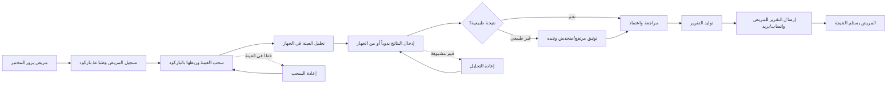

# JOURNEY MAP — LabMgt (SAAS-061)
> Owner: Journey Architect · Gate 1 · Persona: د. ماجد — مدير مختبر

## Flow (Mermaid)

## Stage Annotations
| Stage | User Action | Goal | Emotion | Friction | Screen |
|-------|-------------|------|---------|----------|--------|
| تسجيل المريض | إدخال بيانات المريض | ربط العينة بالمريض | 😐 محايد | إدخال يدوي طويل | Patient Registration |
| سحب العينة | لصق باركود على الأنبوب | تتبع دقيق | 😊 مرتاح | الباركود لا يلتصق أحياناً | Sample Registration |
| تحليل العينة | وضع العينة في الجهاز | قراءة دقيقة | 😌 واثق | لا يوجد ربط تلقائي مع الجهاز | Analyzer Integration |
| إدخال النتائج | تسجيل القيم يدوياً | إدخال سريع | 😓 مجهد | وقت طويل، أخطاء إملائية | Result Entry |
| مراجعة النتائج | التحقق من القيم الشاذة | ضمان الجودة | 🤔 مركز | لا توجد علامات تحذيرية أوتوماتيكية | Result Review |
| إرسال التقرير | ضغط زر إرسال | إيصال سريع للمريض | 😊 راضٍ | لا يعرف طريقة تواصل المريض المفضلة | Report Delivery |
| استلام النتيجة | فتح الرابط أو التطبيق | معرفة النتيجة | 😃 متفائل | قد لا يمتلك المريض التطبيق | Patient Result View |

## Ranked Friction Log
1. [High] إدخال النتائج يدوياً — يستهلك 40% من وقت الفني، عرضة للأخطاء
2. [High] لا يوجد ربط تلقائي مع أجهزة التحليل — يتطلب إدخالاً مزدوجاً
3. [Med] استفسار المرضى هاتفياً — يشتت الموظفين ويستهلك وقت reception
4. [Med] صعوبة تتبع المخزون — المواد تنفد بدون إنذار
5. [Low] طباعة التقارير — هدر ورق ووقت
6. [Low] لا توجد رؤية مالية فورية — صعوبة اتخاذ قرارات التسعير

**Rule:** Every later feature MUST trace to a stage above.
