# JOURNEY MAP — DentistPro (SAAS-062)
> Owner: Journey Architect · Gate 1 · Persona: د. محمد — طبيب أسنان

## Flow (Mermaid)

```mermaid
flowchart LR
  A[مريض يحجز موعد] --> B[تأكيد الحجز وإرسال تذكير]
  B --> C[حضور المريض للعيادة]
  C --> D[تسجيل الدخول واستعراض الملف]
  D --> E[فحص الأسنان وخريطة الأسنان]
  E --> F[تشخيص واقتراح خطة علاج]
  F --> G[تنفيذ العلاج وتسجيل الإجراء]
  G --> H{هل يحتاج متابعة؟}
  H -->|نعم| I[جدولة موعد متابعة]
  H -->|لا| J[إنهاء الزيارة]
  I --> J
  J --> K[إرسال الفاتورة والوصفة]
  K --> L[متابعة التأمين إن وجد]

  A -.->|لم يحضر| M[تسجيل تغيب]
  M --> N[إعادة جدولة]
  N --> B
  C -.->|مريض جديد| O[تسجيل بيانات جديدة]
  O --> D
```

## Stage Annotations
| Stage | User Action | Goal | Emotion | Friction | Screen |
|-------|-------------|------|---------|----------|--------|
| حجز موعد | مريض يتصل أو يستخدم التطبيق | حجز وقت مناسب | 😊 متفائل | المكالمات تستغرق وقتاً، لا توجد فتحات ظاهرة | Appointment Calendar |
| تذكير | إرسال تذكير أوتوماتيكي | تقليل التغيب | 🤖 تلقائي | المريض قد يغير رأيه بعد التذكير | — |
| تسجيل الدخول | استعراض ملف المريض | رؤية التاريخ الطبي | 😐 محايد | البحث عن الملف يستغرق وقتاً | Patient Search |
| خريطة الأسنان | النقر على السن المصاب | تشخيص دقيق | 🤔 مركز | الخريطة تحتاج تدريب لاستخدامها | Tooth Chart |
| خطة علاج | إضافة الإجراءات المقترحة | توثيق الخطة | 😊 واثق | لا توجد أسعار مسبقة للإجراءات | Treatment Plan |
| تنفيذ العلاج | تسجيل الإجراء المنجز | توثيق دقيق | 😌 راضٍ | الإدخال يستغرق وقتاً أثناء العلاج | Treatment Notes |
| الفاتورة | إصدار الفاتورة | تحصيل المبلغ | 😐 محايد | التأمين يعقد عملية الفوترة | Billing |
| متابعة التأمين | تقديم المطالبة | استرداد التكلفة | 😓 مجهد | الإجراءات الورقية طويلة ومملة | Insurance Claim |

## Ranked Friction Log
1. [High] تغيب المرضى — يخسر العيادة 15-20% من الإيرادات
2. [High] حفظ صور الأشعة — نظام ملفات غير منظم، لا يمكن مقارنة الصور
3. [Med] البحث عن ملفات المرضى — فهرسة غير فعالة
4. [Med] إدارة التأمين — إجراءات ورقية معقدة
5. [Low] طباعة الوصفات — هدر ورق، قد يخطئ المريض في القراءة
6. [Low] لا توجد تقارير أداء فورية — صعوبة تحسين العيادة

**Rule:** Every later feature MUST trace to a stage above.
