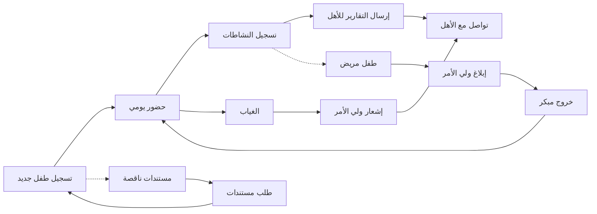

# JOURNEY MAP — NurseryPro (SAAS-074)
> Owner: Journey Architect · Gate 1 · Persona: سارة (Nursery Director)

## Flow (Mermaid)

## Stage Annotations
| Stage | User Action | Goal | Emotion | Friction | Screen |
|-------|-------------|------|---------|----------|--------|
| تسجيل | إدخال بيانات الطفل والمستندات | تسجيل سريع بدون أوراق | 😊 سعيد | مستندات كثيرة | Child Registration |
| حضور | تسجيل الدخول عند الوصول | تتبع الحضور بدقة | 😊 سريع | ازدحام عند البوابة | Check-in |
| نشاطات | تسجيل الأكل والقيلولة والنشاطات | توثيق يوم الطفل | 😐 مركز | إدخال متكرر وممل | Daily Log |
| تقارير | إرسال التقرير لولي الأمر | إطلاع الأهل وتطمينهم | 😊 إيجابي | وقت تحضير التقرير طويل | Activity Report |
| تواصل | رد على استفسارات الأهل | تواصل فعال مع الأهل | 😐 صبور | أسئلة متكررة من الأهل | Messaging |
| غياب | متابعة الأطفال الغائبين | معرفة سبب الغياب | 😐 متابع | أرقام هواتف غير صحيحة | Absence Tracker |
| إشعار | إبلاغ ولي الأمر عن الغياب | التأكد من سلامة الطفل | 😰 قلق | بعض الأهل لا يردون | Notifications |

## Ranked Friction Log
1. [High] وقت إدخال بيانات كل طفل في التسجيل الأولي (20 دقيقة لكل طفل)
2. [High] ازدحام عند بوابة الدخول وقت الذروة (7:30-8:00 صباحاً)
3. [Med] المربيات ينسون تسجيل النشاطات اليومية بسبب الانشغال
4. [Med] بعض أولياء الأمور لا يقرؤون التقارير المرسلة
5. [Low] أجهزة QR/BLE تحتاج صيانة دورية
6. [Low] أولياء الأمور يرسلون نفس الأسئلة المتكررة

**Rule:** Every later feature MUST trace to a stage above.
