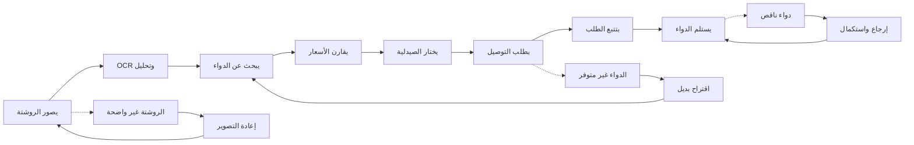

# JOURNEY MAP — PharmacyRx (SAAS-079)
> Owner: Journey Architect · Gate 1 · Persona: عبدالله (Patient)

## Flow (Mermaid)

## Stage Annotations
| Stage | User Action | Goal | Emotion | Friction | Screen |
|-------|-------------|------|---------|----------|--------|
| تصوير روشتة | يصور الوصفة الطبية بالهاتف | إدخال سريع للبيانات | 🤔 متوقع | ضوء ضعيف، صورة مشوشة | Prescription Upload |
| OCR وتحليل | النظام يقرأ ويحلل البيانات | استخراج أسماء الأدوية | 🤖 تلقائي | خط الطبيب صعب يقرأ | OCR Result |
| بحث | البحث عن الدواء في الصيدليات | إيجاد الدواء متوفر | 😊 متفائل | نقص في المخزون | Medicine Search |
| مقارنة | مقارنة أسعار الدواء | أقل سعر متاح | 😊 مدخر | بعض الصيدليات لا تظهر | Price Compare |
| اختيار | تحديد الصيدلية المفضلةالأقرب | طلب من صيدلية قريبة | 😊 مرتاح | سرعة التوصيل تختلف | Pharmacy Select |
| طلب | إدخال عنوان التوصيل والدفع | شراء وتوصيل | 😰 قلق | مشكلة في الدفع | Order Checkout |
| تتبع | متابعة حالة الطلب | معرفة موعد الوصول | 😐 منتظر | التحديثات متأخرة | Order Tracking |
| استلام | استلام الدواء من المندوب | الحصول على الدواء | 😊 شاكر | الدواء يحتاج تبريد | Delivery Receipt |

## Ranked Friction Log
1. [High] خط الأطباء صعب يقرأ في الروشتات اليدوية (OCR يفشل أحياناً)
2. [High] بعض الأدوية تحتاج تبريد وتوصيل خاص
3. [Med] وصفات الأدوية المخدرة تتطلب إجراءات خاصة
4. [Med] الصيدليات لا تروج لأسعارها بشكل شفاف دوماً
5. [Low] المرضى ينسون إعادة صرف الوصفات الشهرية
6. [Low] يخافون من مشاركة معلوماتهم الصحية على الإنترنت

**Rule:** Every later feature MUST trace to a stage above.
