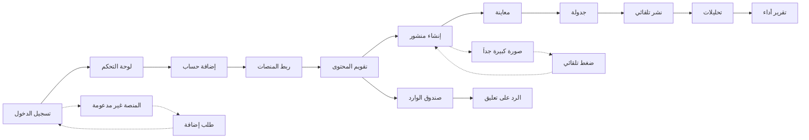

# JOURNEY MAP — SocialKit (SAAS-024)
> Owner: Journey Architect · Gate 1 · Persona: هند (مسوقة رقمية)

## Flow (Mermaid)

## Stage Annotations
| Stage | User Action | Goal | Emotion | Friction | Screen |
|-------|-------------|------|---------|----------|--------|
| ربط | يربط حسابات المنصات | اتصال موحد | 😐 | OAuth يفشل بدون رسالة واضحة | Connect |
| تقويم | يسحب المنشورات للأيام | جدولة أسبوعية | 😊 | صعوبة سحب المنشور بين الأيام | Calendar |
| إنشاء | يكتب منشور ويضيف وسائط | محتوى جذاب | 😊 | معاينة مختلفة لكل منصة | Post Editor |
| نشر | جدولة/نشر فوري | وصول المحتوى | 😊 | خطأ في API المنصة | Publish |
| تحليلات | يعرض التقارير | قياس الأداء | 😊 | بيانات متأخرة 24 ساعة | Analytics |
| رد | يرد على تعليق | تفاعل مع الجمهور | 😐 | اكتشاف التعليق متأخراً | Inbox |

## Ranked Friction Log
1. [High] OAuth يفشل بدون رسالة واضحة → تحسين رسائل الخطأ + إعادة محاولة
2. [High] معاينة مختلفة لكل منصة → معاينة خاصة بكل منصة
3. [Med] جدول النشر لا يحترم توقيت كل منصة → اقتراح أفضل وقت لكل منصة
4. [Med] الوسائط تحتاج ضغط → ضغط تلقائي مع معاينة الجودة
5. [Low] اكتشاف التعليق متأخراً → إشعار فوري عند تعليق جديد

**Rule:** Every later feature MUST trace to a stage above.
