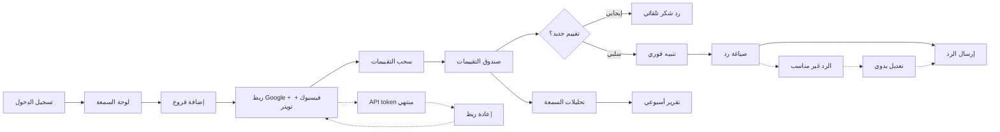

# JOURNEY MAP — ReviewRadar (SAAS-025)
> Owner: Journey Architect · Gate 1 · Persona: ليلى (مديرة تسويق)

## Flow (Mermaid)

## Stage Annotations
| Stage | User Action | Goal | Emotion | Friction | Screen |
|-------|-------------|------|---------|----------|--------|
| ربط | ربط حسابات المنصات | جمع التقييمات | 😐 | توكن منتهي بعد أشهر | Connect |
| مراقبة | متابعة التقييمات الواردة | عدم تفويت أي تقييم | 😊 | تأخير في سحب التقييمات | Inbox |
| تنبيه | تنبيه عند تقييم سلبي | سرعة الاستجابة | 😰 | التنبيه يصل متأخراً | Alert |
| رد | صياغة رد مناسب | تحسين السمعة | 😐 | الردود المقترحة عامة جداً | Reply |
| تحليل | عرض تحليلات السمعة | قياس الأداء | 😊 | الرسوم البيانية تحتاج شرح | Analytics |
| تقرير | استلام التقرير الأسبوعي | توثيق الأداء | 😊 | PDF يصل بصيغة غير منسقة | Report |

## Ranked Friction Log
1. [High] API tokens تنتهي → تجديد تلقائي مع إشعار قبل الانتهاء
2. [High] الردود المقترحة عامة → قوالب ذكية مخصصة للقطاع (مطعم، فندق، عيادة)
3. [Med] تأخير سحب التقييمات إلى 1 ساعة → سحب كل 15 دقيقة للتقييمات الجديدة
4. [Med] التنبيه يصل متأخراً → Push notification فوري
5. [Low] تقارير PDF غير منسقة → قوالب PDF احترافية قابلة للتخصيص

**Rule:** Every later feature MUST trace to a stage above.
