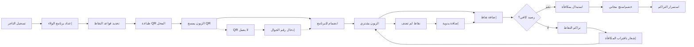

# JOURNEY MAP — LoyaltyBox (SAAS-026)
> Owner: Journey Architect · Gate 1 · Persona: سامي (صاحب مقهى)

## Flow (Mermaid)

## Stage Annotations
| Stage | User Action | Goal | Emotion | Friction | Screen |
|-------|-------------|------|---------|----------|--------|
| إعداد | يحدد قواعد النقاط | برنامج ولاء مخصص | 😊 | الخيارات كثيرة ومربكة | Setup Wizard |
| انضمام | الزبون يمسح QR | عضوية رقمية | 😊 | يحتاج تحميل تطبيق | Join |
| شراء | نقطة بيع | إضافة نقاط | 😐 | الناسخ ينسى إدخال النقاط | POS |
| استبدال | الزبون يستبدل نقاطه | مكافأة | 😊 | المكافأة غير متاحة | Redeem |
| تقارير | عرض إحصائيات | قياس العائد | 😊 | الأرقام لا تظهر ROI واضح | Reports |
| حملات | إنشاء عرض | جذب العملاء | 😐 | العميل ما يشوف العرض | Campaign |

## Ranked Friction Log
1. [High] البائع ينسى إدخال النقاط → تكامل POS مباشر + إشعار تذكير
2. [High] خيارات إعداد البرنامج كثيرة → معالج 3 خطوات مع إعدادات افتراضية ذكية
3. [Med] الزبون يحتاج تحميل تطبيق → دعم Web App + QR مباشر
4. [Med] المكافأة غير متاحة عند الاستبدال → تحديث رصيد المكافآت + إشعار بالنفاد
5. [Low] العميل لا يرى العروض → Push notification + شريط عروض بالتطبيق

**Rule:** Every later feature MUST trace to a stage above.
