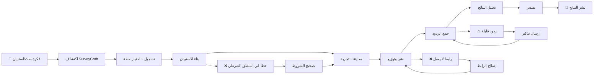

# JOURNEY MAP — SurveyCraft (SAAS-031)
> Owner: Journey Architect · Gate 1 · Persona: أحمد (باحث أكاديمي)

## Flow (Mermaid)

## Stage Annotations
| Stage | User Action | Goal | Emotion | Friction | Screen |
|-------|-------------|------|---------|----------|--------|
| Trigger | يقرر إجراء بحث مسحي | الحصول على بيانات | 😐 محايد | — | — |
| Discover | يبحث عن أداة استبيانات عربية | إيجاد أداة مناسبة | 😟 قلق | قلة الخيارات العربية | Search/Landing |
| Register | يسجل ويختار خطة Freemium | بدء الاستخدام | 😊 راضٍ | — | Register |
| Build | يسحب ويرتب الأسئلة | تصميم الاستبيان | 😊 منتج | واجهة builder تحتاج تعلم | Survey Builder |
| Preview | يختبر الاستبيان كعميل | التأكد من الصحة | 😐 مركز | اكتشاف أخطاء الشرطية | Live Preview |
| Distribute | ينسخ رابط المشاركة | نشر الاستبيان | 🙂 سريع | لا توجد مشاكل كبيرة | Share Modal |
| Collect | يراقب الردود في لوحة التحكم | متابعة التقدم | 😊 راضٍ | — | Response Dashboard |
| Analyze | يتفحص الرسوم البيانية والجداول | استخراج النتائج | 🤔 منغمس | بعض التحليلات تحتاج تعمق | Analytics |
| Export | يختار CSV/Excel/SPSS | تحميل البيانات | 😊 راضٍ | — | Export Dialog |
| Goal | ينشر النتائج | إنجاز البحث | 😃 سعيد | — | — |

## Ranked Friction Log
1. **[High]** بناء المنطق الشرطي معقد — يحتاج واجهة بصرية واضحة لقواعد If/Then
2. **[Med]** توزيع الاستبيان عبر قنوات متعددة — يحتاج زر مشاركة متكامل (رابط + QR + HTML embed + وسائل التواصل)
3. **[Med]** تحليل النتائج يحتاج تعمق — بعض المستخدمين يريدون cross-tabulation و filter
4. **[Low]** تصدير SPSS يتطلب تنسيق حقول خاص
5. **[Low]** قوالب عربية قليلة في البداية

**Rule:** Every later feature MUST trace to a stage above.
