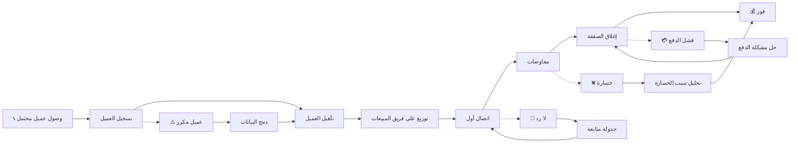

# JOURNEY MAP — LeadFunnel (SAAS-032)
> Owner: Journey Architect · Gate 1 · Persona: خالد (مدير مبيعات)

## Flow (Mermaid)

## Stage Annotations
| Stage | User Action | Goal | Emotion | Friction | Screen |
|-------|-------------|------|---------|----------|--------|
| Trigger | عميل يتصل أو يملأ استمارة | بدء التدفق | 😐 محايد | — | — |
| Enter | خالد يسجل بيانات العميل | تسجيل سريع | 😊 سريع | — | Quick Add Lead |
| Qualify | يقيم جودة العميل | تحديد الأولوية | 😐 مركز | يحتاج معايير واضحة | Lead Scoring |
| Assign | يوزع العميل على مندوب | توزيع عادل | 🤔 قلق | توزيع يدوي متعب | Assign Modal |
| Contact | مندوب يتصل بالعميل | بدء العلاقة | 😊 متفائل | لا ردود أحياناً | Lead Detail |
| Negotiate | مندوب يتابع الصفقة | إقناع العميل | 😐 متوتر | صعوبة تتبع المراحل | Pipeline Kanban |
| Close | توقيع العقد | تحويل | 😃 منتشي | — | Deal Confirmation |
| Goal | استلام الدفعة | ربح | 😃 سعيد | — | — |

## Ranked Friction Log
1. **[High]** توزيع العملاء يدوياً على المندوبين — يحتاج Auto-assignment
2. **[High]** لا توجد تنبيهات للمتابعة — يحتاج تذكيرات ذكية عبر واتساب
3. **[Med]** صعوبة معرفة مرحلة الصفقة الحالية — يحتاج Kanban view مع filter
4. **[Med]** بيانات العملاء مبعثرة بين Excel وواتساب — مركزية في LeadFunnel
5. **[Low]** استيراد العملاء الحاليين من Excel — معالج استيراد سهل

**Rule:** Every later feature MUST trace to a stage above.
