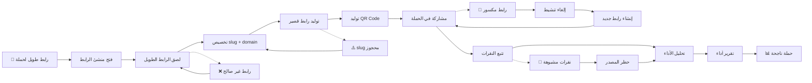

# JOURNEY MAP — URLShort Pro (SAAS-037)
> Owner: Journey Architect · Gate 1 · Persona: رنا (أخصائية تسويق)

## Flow (Mermaid)

## Stage Annotations
| Stage | User Action | Goal | Emotion | Friction | Screen |
|-------|-------------|------|---------|----------|--------|
| Trigger | رنا تحضر رابط حملة | بدء الاختصار | 😐 محايد | — | — |
| Create | تفتح منشئ الرابط | إنشاء رابط قصير | 🙂 جاهزة | — | Link Creator |
| Paste | تنسخ الرابط الطويل | إدخال | 😊 سريع | — | Input |
| Customize | تكتب slug مخصص | تخصيص الرابط | 😐 مركز | slug قد يكون محجوزاً | Customize Panel |
| Generate | تضغط "إنشاء" | اختصار | 🙂 سريع | — | Result |
| QR | QR يتولد تلقائياً | جاهزية | 😊 راضية | — | QR Preview |
| Share | تنسخ الرابط للحملة | توزيع | 🙂 سريع | — | Copy Actions |
| Track | تتابع النقرات | مراقبة | 😐 عادي | — | Analytics |
| Analyze | تحلل الأداء حسب المصدر | تحسين الحملات | 🤔 مركزة | — | Analytics Dashboard |
| Report | تصدر التقرير | إثبات النتائج | 😃 راضية | — | Export |

## Ranked Friction Log
1. **[High]** Bitly مكلف للميزات المتقدمة — أسعار $19-$49 مع ميزات كاملة
2. **[High]** QR code منفصل (يحتاج أداة أخرى) — QR تلقائي لكل رابط
3. **[Med]** تحليلات محدودة بدون فلترة حسب المصدر — تحليلات مفصلة
4. **[Med]** الرابط المخصص slug محجوز — اقتراحات بديلة تلقائية
5. **[Low]** تصدير التقارير يحتاج تحميل يدوي — تقارير آلية دورية

**Rule:** Every later feature MUST trace to a stage above.
