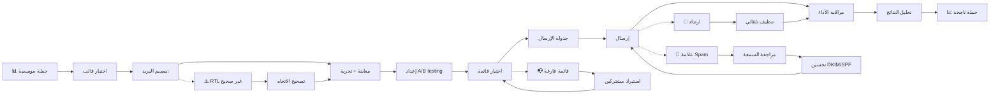

# JOURNEY MAP — MailCraft (SAAS-038)
> Owner: Journey Architect · Gate 1 · Persona: ياسر (مدير تسويق)

## Flow (Mermaid)

## Stage Annotations
| Stage | User Action | Goal | Emotion | Friction | Screen |
|-------|-------------|------|---------|----------|--------|
| Trigger | ياسر يخطط حملة موسمية | بدء الحملة | 😊 متحمس | — | — |
| Choose Template | يختار قالباً جاهزاً | توفير وقت | 🙂 سريع | القوالب محدودة | Template Gallery |
| Design | يسحب ويعدل القالب | تخصيص البريد | 😐 مركز | RTL يحتاج ضبط | Email Builder |
| Preview | يختبر البريد في عدة عملاء | تأكيد الجودة | 🤔 قلق | أخطاء RTL | Preview |
| A/B Test | يضبط متغيرين | تحسين الأداء | 😐 مركز | — | AB Test Setup |
| Select List | يختار قائمة المشتركين | استهداف | 🙂 جاهز | — | List Select |
| Schedule | يحدد وقت الإرسال | توقيت مثالي | 😊 جاهز | — | Schedule |
| Send | البريد ينطلق للقائمة | إرسال | 😊 راضٍ | — | Sending |
| Monitor | يراقب الفتح والنقر آنياً | متابعة | 😐 عادي | — | Campaign Monitor |
| Analyze | يحلل النتائج | استخلاص الدروس | 🤔 متفكر | — | Analytics |

## Ranked Friction Log
1. **[High]** قوالب عربية محدودة وRTL صعب — محرر drag-drop مع معاينة RTL
2. **[High]** تكاليف مرتفعة للقوائم المتوسطة — تسعير $19-$99
3. **[High]** رسائل تذهب للـ Spam — أدوات تحسين السمعة + DKIM/SPF
4. **[Med]** استيراد المشتركين من Mailchimp صعب — أداة ترحيل بنقرة زر
5. **[Med]** A/B testing معقد — واجهة بسيطة بنقرتين

**Rule:** Every later feature MUST trace to a stage above.
