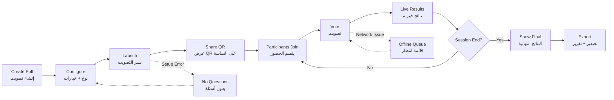

# JOURNEY MAP — PollPro (SAAS-042)
> Owner: Journey Architect · Gate 1 · Persona: ليلى (منسقة مؤتمرات)

## Flow (Mermaid)

## Stage Annotations
| Stage | User Action | Goal | Emotion | Friction | Screen |
|-------|-------------|------|---------|----------|--------|
| Create | يضغط "New Poll" ويختار النوع | بدء سريع | 😊 متحمس | أنواع التصويت غير واضحة | Poll Builder |
| Configure | يضيف الأسئلة والخيارات | تخصيص التصويت | 🤔 مركز | إضافة خيارات كثيرة مملة | Poll Builder |
| Launch | ينشر ويظهر QR | بدء التصويت | 😌 راضٍ | يحتاج التبديل بين الشاشات | Projector View |
| Join | يمسح QR ضوئياً | الدخول للتصويت | 😊 سهل | اتصال إنترنت بطيء | Mobile Join |
| Vote | يختار إجابة ويضغط Submit | المشاركة | 🧐 مفكر | خيارات غير واضحة على الجوال | Mobile Vote |
| Results | يرى النتائج الحية على الشاشة | معرفة الفائز | 😲 مفاجأة | تأخير في التحديث | Projector/Live |

## Ranked Friction Log
1. [High] تأخير النتائج على الشاشة الكبيرة (أكثر من ثانيتين)
2. [Med] صعوبة إنشاء تصويت سريع أثناء الجلسة (يحتاج 5+ نقرات)
3. [Med] الحضور لا يستطيعون مسح QR لبعدهم عن الشاشة
4. [Low] نقص خيارات التخصيص (ألوان، شعار)
5. [Low] الحاجة لتصدير النتائج بعد الجلسة
