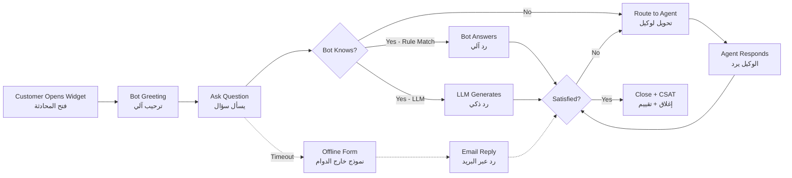

# JOURNEY MAP — ChatFlow (SAAS-044)
> Owner: Journey Architect · Gate 1 · Persona: نور (صاحبة متجر)

## Flow (Mermaid)

## Stage Annotations
| Stage | User Action | Goal | Emotion | Friction | Screen |
|-------|-------------|------|---------|----------|--------|
| Open Widget | ينقر أيقونة chat في الموقع | بدء محادثة | 😊 متحمس | widget يغطي محتوى الصفحة | Widget |
| Bot Greeting | يرى رسالة ترحيب | تواصل فوري | 😌 مرتاح | الترحيب طويل جداً | Widget |
| Ask Question | يكتب سؤاله | حل المشكلة | 🤔 مركز | البوت لا يفهم السؤال | Widget |
| Bot Answers | يحصل على رد سريع | توفير وقت | 😊 سعيد | الرد غير دقيق | Widget |
| Route to Agent | يُحوَّل لوكيل | مساعدة بشرية | 😤 محبط (انتظر) | وقت الانتظار طويل | Widget |
| CSAT | يقيم المحادثة | تحسين الخدمة | 😐 محايد | التقييم يظهر مبكراً | Widget |

## Ranked Friction Log
1. [High] البوت لا يفهم صياغة الأسئلة العربية المختلفة
2. [High] وقت انتظار الوكيل طويل (أكثر من دقيقتين)
3. [Med] widget يغطي محتوى مهم في الجوال
4. [Med] الوكيل لا يرى تاريخ العميل السابق
5. [Low] العميل يقيم قبل أن يحصل على حل كامل
