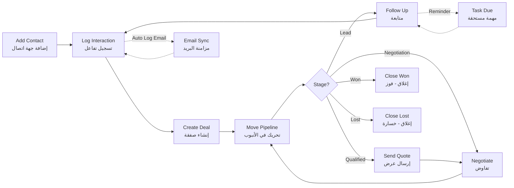

# JOURNEY MAP — NetworkHub CRM (SAAS-049)
> Owner: Journey Architect · Gate 1 · Persona: كريم (مستشار)

## Flow (Mermaid)

## Stage Annotations
| Stage | User Action | Goal | Emotion | Friction | Screen |
|-------|-------------|------|---------|----------|--------|
| Add Contact | يدخل اسم العميل ومعلوماته | بناء قاعدة البيانات | 😊 سهل | إدخال 20 حقلًا متعب | Contact Form |
| Log Interaction | يسجل مكالمة/بريد/واتساب | توثيق التواصل | 🤔 مركز | ينسى تسجيل المكالمات | Interaction Log |
| Create Deal | ينشئ صفقة من جهة الاتصال | بدء تتبع البيع | 😐 محايد | يخلط بين الصفقات | Deal Form |
| Move Pipeline | يسحب الصفقة للمرحلة التالية | تقدم البيع | 😌 راضٍ | السحب لا يعمل في الجوال | Pipeline Board |
| Follow Up | يتلقى تذكيراً | متابعة العميل | 😤 محبط (كثرة التذكيرات) | تذكيرات عامة غير محددة | Tasks |
| Report | يطلع على تقارير المبيعات | تحليل الأداء | 😊 فخور (إذا المبيعات جيدة) | التقارير لا تصدر PDF | Reports |

## Ranked Friction Log
1. [High] نسيان تسجيل التفاعلات (مكالمات، واتساب، بريد)
2. [High] كثرة التذكيرات العامة غير المحددة بمهام محددة
3. [Med] السحب والإفلات لا يعمل في الجوال
4. [Med] استيراد جهات الاتصال من CSV صعب
5. [Low] لا يوجد دمج تلقائي للمكررات
