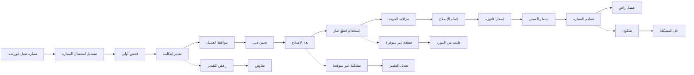

# JOURNEY MAP — GarageMaster (SAAS-010)
> Owner: Journey Architect · Gate 1 · Persona: أبو خالد — صاحب ورشة

## المسار (Mermaid)

## تعليقات المراحل
| المرحلة | إجراء المستخدم | الهدف | المشاعر | الاحتكاك | الشاشة |
|----------|----------------|-------|---------|----------|--------|
| استقبال | تسجيل بيانات السيارة والعميل | بدء أمر العمل | 🙂 راض | إدخال تفاصيل | Job Order Create |
| فحص | فحص السيارة وتدوين الملاحظات | تحديد المشكلة | 😐 مركز | نسيان بعض التفاصيل | Inspection Form |
| تقدير | حساب التكلفة والوقت | موافقة العميل | 😐 محايد | تقدير غير دقيق | Estimate |
| إصلاح | فني ينفذ الإصلاحات | إصلاح السيارة | 😐 مركز | نقص قطع الغيار | Job Detail |
| فاتورة | إصدار فاتورة مفصلة | تحصيل المبلغ | 😊 راض | نزاعات على الأسعار | Invoice |
| تسليم | تسليم السيارة للعميل | إسعاد العميل | 😊 فخور | تأخير في التسليم | Delivery |

## سجل الاحتكاك المرتب
1. [High] نقص قطع الغيار يؤخر العمل → حل: مخزون مع حد أدنى + طلب تلقائي (Screen 3)
2. [High] العملاء يتصلون للاستفسار → حل: إشعارات حالة تلقائية (Screen 5)
3. [Med] الفنيون لا يسجلون القطع → حل: تسجيل إجباري قبل إتمام الأمر (Screen 4)
4. [Med] تقدير التكلفة غير دقيق → حل: أسعار خدمات مسبقة + سجل تاريخي (Screen 2)
5. [Low] الفواتير اليدوية تخطئ → حل: فواتير إلكترونية تلقائية (Screen 6)
