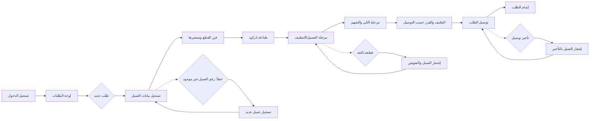

# JOURNEY MAP — LaundryHub (SAAS-015)
> Owner: Journey Architect · Gate 1 · Persona: محمد الدوسري

## Flow (Mermaid)

## Stage Annotations
| Stage | User Action | Goal | Emotion | Friction | Screen |
|-------|-------------|------|---------|----------|--------|
| لوحة الطلبات | عرض الطلبات النشطة والمعلقة | نظرة على سير العمل | إيجابية | كثرة الطلبات بدون فلترة | شاشة الطلبات |
| طلب جديد | تسجيل بيانات العميل والقطع | إنشاء طلب | محايدة | بطء إدخال بيانات القطع يدوياً | نموذج طلب جديد |
| فرز وتسعير | تصنيف القطع (نوع الغسيل) وتسعيرها | تحديد الخدمة | محايدة | اختلاف الأسعار بين الخدمات | شاشة الفرز |
| طباعة باركود | لصق الباركود على كيس الطلب | تتبع القطع | إيجابية | طباعة بطيئة | شاشة الباركود |
| مرحلة الغسيل | تحديث حالة الطلب عند كل مرحلة | تتبع التقدم | إيجابية | نسيان تحديث الحالة | شاشة الإنتاج |
| التوصيل | تعيين سائق وجدولة التوصيل | إيصال الطلب | محايدة | تداخل مواعيد التوصيل | شاشة التوصيل |
| إتمام الطلب | تأكيد استلام العميل | إغلاق الطلب | راضية | عدم تأكيد الاستلام | شاشة الإتمام |

## Ranked Friction Log
1. [High] ضياع القطع أو اختلاط طلبات العملاء
2. [High] عدم وضوح حالة الطلب للعميل (أين قطعة الملابس حالياً؟)
3. [Med] صعوبة جدولة توصيل متعددة في نفس الحي
4. [Med] بطء إدخال قطع الملابس الكثيرة يدوياً
5. [Low] عدم وجود قوائم أسعار مبرمجة مسبقاً حسب نوع القطعة

**Rule:** Every later feature MUST trace to a stage above.
