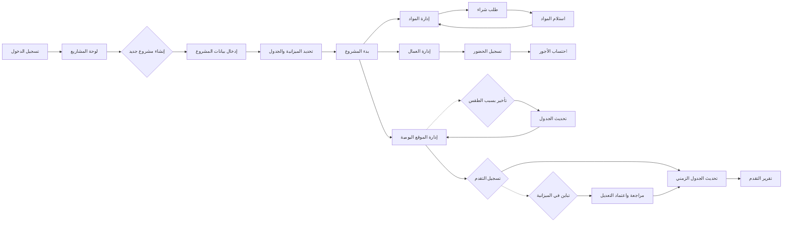

# JOURNEY MAP — BuildTrack (SAAS-016)
> Owner: Journey Architect · Gate 1 · Persona: عبدالله السبيعي

## Flow (Mermaid)

## Stage Annotations
| Stage | User Action | Goal | Emotion | Friction | Screen |
|-------|-------------|------|---------|----------|--------|
| لوحة المشاريع | عرض المشاريع النشطة والتقدم | نظرة شاملة | إيجابية | كثرة المشاريع بدون تصنيف | شاشة المشاريع |
| إنشاء مشروع | إدخال الاسم والموقع والقيمة | تسجيل المشروع | محايدة | كثرة التفاصيل الإدارية | معالج المشروع |
| إدارة الموقع | تسجيل الحضور والمهام اليومية | توثيق العمل | محايدة | مقاومة العمال للتسجيل الرقمي | شاشة اليوميات |
| تسجيل التقدم | إدخال نسبة الإنجاز في كل مرحلة | قياس الأداء | إيجابية | التقدير غير الدقيق للنسب | شاشة التقدم |
| إدارة المواد | متابعة المخزون وطلبات الشراء | تأمين المواد | محايدة | نقص فجائي في مواد حرجة | شاشة المواد |
| تقرير التقدم | عرض النسب والجداول والرسوم | توثيق للعميل | إيجابية | بيانات غير كافية | شاشة التقارير |
| إغلاق المشروع | مراجعة نهائية + تسليم | إكمال المشروع | راضية | نقص في التوثيق النهائي | شاشة الإغلاق |

## Ranked Friction Log
1. [High] نقص فجائي في مواد البناء يؤخر العمل
2. [High] عدم دقة في تقدير نسب الإنجاز الأسبوعية
3. [Med] صعوبة تتبع حضور العمال بشكل يومي
4. [Med] إهدار في المواد بسبب سوء التخزين
5. [Low] كثرة التعديلات على المخططات دون توثيق

**Rule:** Every later feature MUST trace to a stage above.
