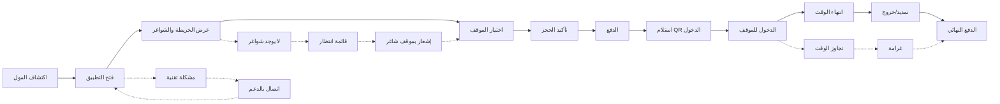

# JOURNEY MAP — ParkingIQ (SAAS-021)
> Owner: Journey Architect · Gate 1 · Persona: خالد (سائق)

## Flow (Mermaid)

## Stage Annotations
| Stage | User Action | Goal | Emotion | Friction | Screen |
|-------|-------------|------|---------|----------|--------|
| اكتشاف | يحدد المول على الخريطة | معرفة المواقف القريبة | 😊 | بطء تحميل الخريطة | Home |
| اختيار | يختار موقفاً على الخريطة | حجز الموقع المثالي | 😐 | الواجهة تظهر شواغر غير محدثة | Map |
| حجز | يؤكد الحجز والوقت | ضمان الموقف | 😊 | وقت الحجز الافتراضي غير مناسب | Booking |
| دفع | يدفع عبر Mada/Apple Pay | إتمام الدفع بسرعة | 😊 | بوابة الدفع ترفض البطاقة | Payment |
| دخول | يمسح QR للدخول | دخول سلس | 😊 | الكاميرا لا تقرأ QR | QR Gate |
| خروج | يدفع الفرق/يخرج | مغادرة بدون غرامة | 😊 | رسوم إضافية غير متوقعة | Exit |

## Ranked Friction Log
1. [High] عرض شواغر غير محدثة → يجب تكامل آني مع حساسات/عدادات
2. [High] بوابة الدفع ترفض → رسائل خطأ واضحة + طرق دفع بديلة
3. [Med] وقت الحجز الافتراضي → السماح بتعديل الوقت بسهولة
4. [Med] تجاوز الوقت بدون تذكير → Push notification قبل انتهاء الوقت
5. [Low] الكاميرا لا تقرأ QR → إدخال رقم يدوي أو NFC

**Rule:** Every later feature MUST trace to a stage above.
