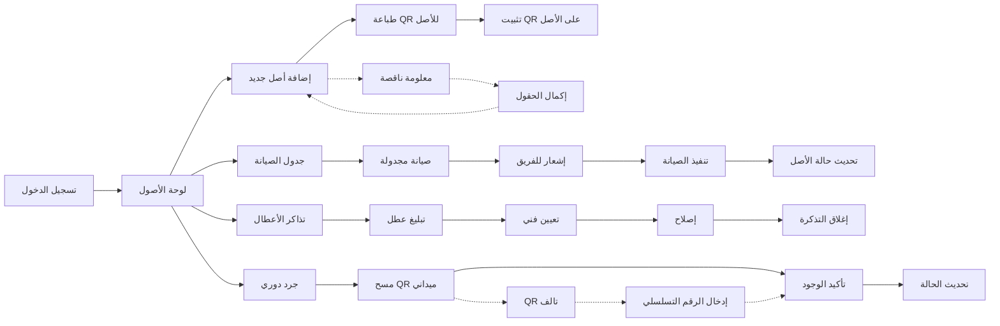

# JOURNEY MAP — AssetGuard (SAAS-028)
> Owner: Journey Architect · Gate 1 · Persona: خالد (مدير صيانة)

## Flow (Mermaid)

## Stage Annotations
| Stage | User Action | Goal | Emotion | Friction | Screen |
|-------|-------------|------|---------|----------|--------|
| إضافة | إدخال بيانات الأصل | تسجيل جديد | 😐 | حقول كثيرة (20+ حقل) | Add Asset |
| QR | طباعة QR وتثبيته | تعريف الأصل | 😊 | الطابعة لا تدعم QR | QR Print |
| صيانة | جدولة صيانة | منع الأعطال | 😊 | صعوبة تحديد التكرار | Maintenance |
| عطل | تبليغ عن عطل | إصلاح سريع | 😰 | الأولوية غير واضحة | Ticket |
| جرد | مسح QR ميداني | تأكيد الوجود | 😊 | QR لا يقرأ من مسافة | Audit |
| تقرير | عرض التقارير | معرفة الوضع | 😊 | التقارير لا تصدر PDF | Reports |

## Ranked Friction Log
1. [High] إضافة أصل جديد يحتاج 20+ حقل → معالج خطوات مع حقول إجبارية محدودة
2. [High] QR لا يقرأ من مسافة بعيدة → استخدام QR كبير + دعم باركود
3. [Med] صعوبة تحديد تكرار الصيانة → اقتراح ذكي بناءً على فئة الأصل
4. [Med] تقارير لا تصدر PDF → PDF export + جدولة تقارير
5. [Low] تذكرة عطل بدون أولوية → auto-priority بناءً على نوع الأصل

**Rule:** Every later feature MUST trace to a stage above.
