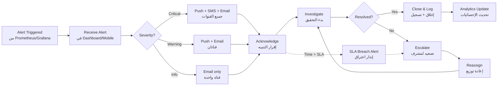

# JOURNEY MAP — AlertHub (SAAS-041)
> Owner: Journey Architect · Gate 1 · Persona: أحمد (مهندس DevOps)

## Flow (Mermaid)

## Stage Annotations
| Stage | User Action | Goal | Emotion | Friction | Screen |
|-------|-------------|------|---------|----------|--------|
| Trigger | System sends alert via webhook | إعلام سريع | 😐 محايد | تكامل مع Prometheus | API Webhook |
| Receive | يرى التنبيه في Dashboard | رؤية فورية | 😰 قلق (Critical) | ضوضاء تنبيهات غير مهمة | Dashboard |
| Acknowledge | ينقر Acknowledge | تأكيد الاستلام | 😌 ارتياح | يحتاج tap إضافي | Alert Detail |
| Investigate | يفتح رابط Grafana المنضم | بدء التحقيق | 🤔 تركيز | نقص السياق المرفق | Alert Detail |
| Escalate | يعيد توزيع التنبيه | ضمان المتابعة | 😤 إحباط | صعوبة إيجاد البديل | Assignment Modal |
| Close | يغلق مع تعليق | توثيق الحل | ✅ رضا | ينسى إضافة التعليق | Alert Detail |

## Ranked Friction Log
1. [High] ضوضاء تنبيهات — تنبيهات متكررة غير مهمة تغطي على الحرجة
2. [High] نقص سياق — التنبيه يصل بدون معلومات كافية عن السبب
3. [Med] صعوبة التصعيد — لا يعرف من المتاح حالياً للتصعيد
4. [Med] لا توجد قوالب — كتابة تنبيه جديد من الصفر في كل مرة
5. [Low] نسيان إضافة تعليق — الإغلاق بدون توثيق
