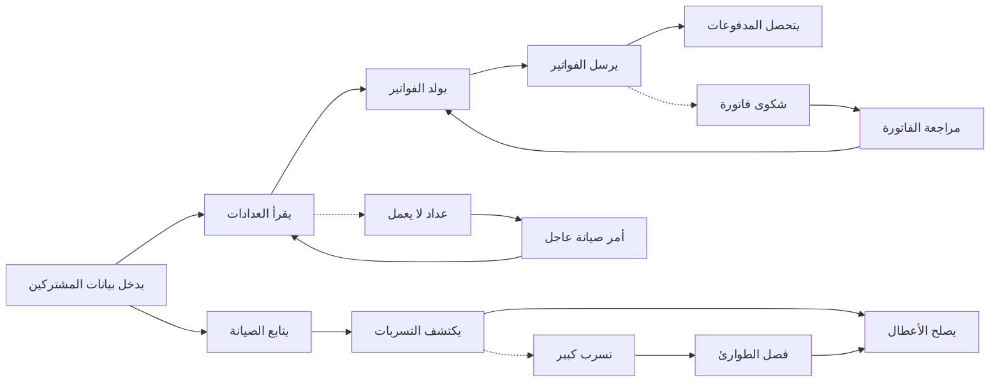

# JOURNEY MAP — WaterMgt (SAAS-073)
> Owner: Journey Architect · Gate 1 · Persona: فهد (Network Manager)

## Flow (Mermaid)

## Stage Annotations
| Stage | User Action | Goal | Emotion | Friction | Screen |
|-------|-------------|------|---------|----------|--------|
| إدخال بيانات | يسجل مشتركين جدد مع قراءات العداد | بناء قاعدة بيانات دقيقة | 😐 عادي | بيانات قديمة غير دقيقة | Consumer Import |
| قراءة عدادات | فني يقرأ العدادات ميدانياً | قراءات دقيقة للفوترة | 😊 سريع | عداد في مكان صعب | Meter Reading |
| توليد فواتير | النظام يحسب الفواتير حسب الشرائح | فواتير دقيقة بدون أخطاء | 🤔 منتبه | تسعير الشرائح معقدة | Billing Engine |
| إرسال فواتير | إشعار المشتركين بالفاتورة | تحصيل في الوقت المحدد | 😐 عادي | مشتركين بدون تواصل | Invoice Dispatch |
| تحصيل | متابعة المدفوعات والمتأخرات | تحصيل 95%+ من الفواتير | 😊 راضٍ | متأخرات كثيرة | Collections |
| صيانة | جدولة وإرسال فرق الصيانة | إصلاح الأعطال بسرعة | 😊 منظم | أوراق عمل ورقية | Work Orders |
| كشف تسربات | تحليل بيانات التدفق | اكتشاف التسرب مبكراً | 😰 قلق | إنذارات كاذبة كثيرة | Leak Detection |
| إصلاح | الفريق يصلح العطل | إنهاء العطل بسرعة | 😊 مرتاح | قطع غيار غير متوفرة | Repair Dispatch |

## Ranked Friction Log
1. [High] ترحيل البيانات القديمة من Excel وأنظمة DOS إلى النظام الجديد
2. [High] بعض العدادات في أماكن يصعب الوصول إليها
3. [Med] الفنيون الميدانيون يقاومون استخدام التطبيق الجديد
4. [Med] إنذارات كاذبة في نظام كشف التسربات (50%+ قد تكون كاذبة)
5. [Low] بعض المشتركين لا يستلمون الإشعارات (أرقام هواتف قديمة)
6. [Low] تقارير NRW تحتاج تفسير للفريق الإداري

**Rule:** Every later feature MUST trace to a stage above.
