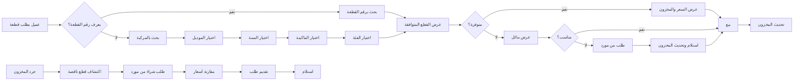

# JOURNEY MAP — SpareParts (SAAS-089)
> Owner: Journey Architect · Gate 1 · Persona: منصور الحربي

## Flow (Mermaid)

## Stage Annotations
| Stage | User Action | Goal | Emotion | Friction | Screen |
|-------|-------------|------|---------|----------|--------|
| بحث بالمركبة | إدخال موديل/سنة/ماكينة | إيجاد القطعة المناسبة | 😟 قلق → 😊 وجدت | القطع متشابهة، قد يخطئ | Part Search |
| عرض القطع | مشاهدة القطع المتوافقة | اختيار القطعة الصحيحة | 😐 مقارن | أرقام OEM متعددة مربكة | Compatible Parts |
| بيع قطعة | إصدار فاتورة + خصم مخزون | إتمام البيع | 😊 راضٍ | العميل يريد خصماً | Sale POS |
| طلب من مورد | إنشاء أمر شراء | توفير القطعة | 😐 منتظر | المورد يتأخر | Purchase Order |
| استلام مشتريات | إضافة للمخزون | تجديد المخزون | 😐 روتيني | تطابق الكميات يحتاج تدقيق | Receive Stock |

## Ranked Friction Log
1. [High] البحث في آلاف القطع بدون نظام — بطء وأخطاء
2. [High] شراء قطع لا يحتاجها المحل — تكرار المخزون
3. [High] عدم دقة المخزون — يبيع قطعة غير موجودة
4. [Med] أرقام القطع المتعددة (OEM و aftermarket) تربك
5. [Med] مقارنة أسعار الموردين يدوياً

**Rule:** Every later feature MUST trace to a stage above.
