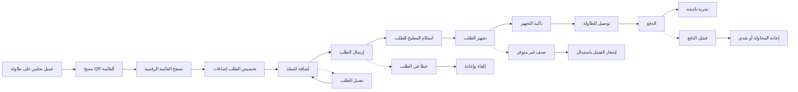

# JOURNEY MAP — MenuByte (SAAS-003)
> Owner: Journey Architect · Gate 1 · Persona: عمر — صاحب مطعم

## المسار (Mermaid)

## تعليقات المراحل
| المرحلة | إجراء المستخدم | الهدف | المشاعر | الاحتكاك | الشاشة |
|----------|----------------|-------|---------|----------|--------|
| Scan QR | العميل يمسح QR الكود على الطاولة | فتح القائمة | 😐 محايد | الكاميرا لا تعمل | QR Scanner |
| Browse Menu | يتصفح الأقسام والصور | اختيار الوجبة | 😊 متحمس | كثرة الخيارات | Menu Grid |
| Customize | يضيف إضافات للوجبة | تخصيص الطلب | 🙂 راض | واجهة معقدة | Customize Sheet |
| Place Order | يضغط إرسال الطلب | بدء التجهيز | 😊 راض | بطء الرفع | Order Confirmed |
| Kitchen Prep | شيف يرى الطلب على KDS | تجهيز دقيق وسريع | 😐 مركز | صعوبة قراءة الطلب | KDS Queue |
| Serve | ويتري يوصل الطلب | إسعاد العميل | 😊 سعيد | خطأ في رقم الطاولة | Serve Alert |
| Pay | العميل يدفع | إتمام المعاملة | 🙂 راض | فشل الدفع الرقمي | Payment |

## سجل الاحتكاك المرتب
1. [High] أخطاء نقل الطلبات من النادل للمطبخ → حل: طلب مباشر من العميل (Screen 2)
2. [High] بطء الخدمة وقت الذروة → حل: توزيع الطلبات تلقائياً على المطبخ (Screen 3)
3. [Med] صعوبة تحديث قوائم الطعام المطبوعة → حل: قائمة رقمية قابلة للتعديل (Screen 1)
4. [Med] عدم معرفة العميل بحالة الطلب → حل: إشعارات مرحلية (Screen 4)
5. [Low] فشل الدفع الإلكتروني → حل: خيار نقدي احتياطي (Screen 5)
