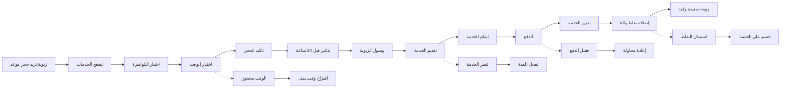

# JOURNEY MAP — SalonPro (SAAS-008)
> Owner: Journey Architect · Gate 1 · Persona: منال — صاحبة صالون

## المسار (Mermaid)

## تعليقات المراحل
| المرحلة | إجراء المستخدم | الهدف | المشاعر | الاحتكاك | الشاشة |
|----------|----------------|-------|---------|----------|--------|
| Browse | تتصفح الخدمات والأسعار | اختيار الخدمة | 🙂 مهتمة | كثرة الخيارات | Services Grid |
| Select Stylist | تختار الكوافيرة المفضلة | ضمان الجودة | 😊 مطمئنة | غير متأكدة من الأسماء | Stylist Profiles |
| Pick Time | تختار وقتاً مناسباً | حجز مريح | 😐 محايد | الأوقات المتاحة محدودة | Time Slots |
| Service | الكوافيرة تقدم الخدمة | تجربة ممتعة | 😊 سعيدة | انتظار طويل أحياناً | (in-person) |
| Pay + Points | تدفع وتجمع نقاط | مكافأة الولاء | 😊 راضية | لا تعرف رصيد النقاط | Payment + Loyalty |

## سجل الاحتكاك المرتب
1. [High] تضارب مواعيد الكوافيرات → حل: كشف ازدواج فوري + اقتراح بديل (Screen 2)
2. [High] حساب العمولات يدوي مرهق → حل: عمولات تلقائية مع تقارير (Screen 5)
3. [Med] الزبونات ينسون المواعيد → حل: تذكير واتساب 24 ساعة و 1 ساعة (Screen 3)
4. [Med] برنامج الولاء غير مفعل → حل: نقاط + مكافآت + إشعارات (Screen 6)
5. [Low] صعوبة تقييم الخدمة → حل: تقييم سريع بنجوم + تعليق (Screen 7)
