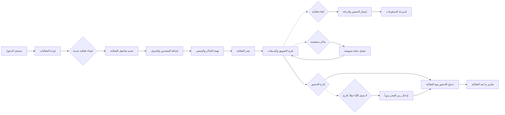

# JOURNEY MAP — Eventify (SAAS-013)
> Owner: Journey Architect · Gate 1 · Persona: ليلى الشمري

## Flow (Mermaid)

## Stage Annotations
| Stage | User Action | Goal | Emotion | Friction | Screen |
|-------|-------------|------|---------|----------|--------|
| تسجيل الدخول | إدخال البريد الإلكتروني وكلمة المرور | الوصول | محايدة | نسيان كلمة المرور | شاشة الدخول |
| لوحة الفعاليات | عرض الفعاليات النشطة والقادمة | نظرة شاملة | إيجابية | عدم تصنيف الفعاليات | لوحة التحكم |
| إنشاء فعالية | تعبئة نموذج التفاصيل | إنشاء صفحة الفعالية | إيجابية | كثرة الحقول الإلزامية | معالج الإنشاء |
| إضافة المتحدثين | إدخال بيانات المتحدثين وجدولهم | تنظيم الجدول | محايدة | صعوبة تنسيق المواعيد | جدول المتحدثين |
| التذاكر والتسعير | تحديد أنواع التذاكر والأسعار | تفعيل المبيعات | إيجابية | عدم مرونة خيارات التذاكر | إعداد التذاكر |
| إدارة الحضور | مسح QR عند الدخول | توثيق الحضور | إيجابية | بطء قارئ QR في الزحام | شاشة الدخول |
| التقارير | عرض إحصائيات ورسوم بيانية | قياس النجاح | راضية | بيانات غير كافية | لوحة التقارير |

## Ranked Friction Log
1. [High] حجوزات مزدوجة عند تعدد المتحدثين في نفس الوقت
2. [High] صعوبة تتبع مبيعات التذاكر بشكل لحظي
3. [Med] عدم مرونة في خيارات خصومات التذاكر (كود خصم، حجز مبكر)
4. [Med] ضعف تكامل بوابات الدفع المحلية (مدى، STC Pay)
5. [Low] بطء تحميل لوحة الفعاليات عند كثرة الفعاليات

**Rule:** Every later feature MUST trace to a stage above.
