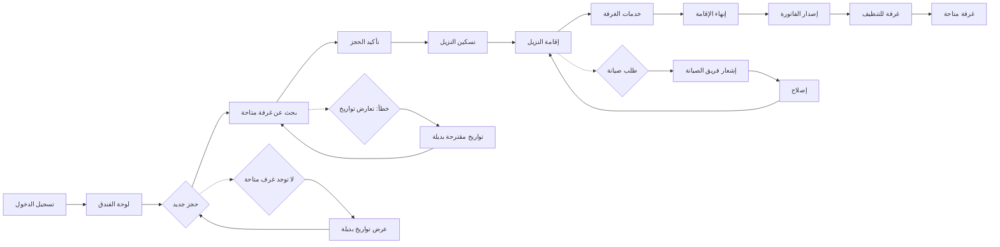

# JOURNEY MAP — HotelEase (SAAS-014)
> Owner: Journey Architect · Gate 1 · Persona: سلمان العتيبي

## Flow (Mermaid)

## Stage Annotations
| Stage | User Action | Goal | Emotion | Friction | Screen |
|-------|-------------|------|---------|----------|--------|
| لوحة الفندق | عرض الإشغال والتوافر والإيرادات | نظرة شاملة | إيجابية | كثرة المعلومات بدون تصنيف | شاشة لوحة التحكم |
| حجز جديد | البحث عن غرفة في تاريخ محدد | إيجاد غرفة شاغرة | محايدة | بطء البحث | شاشة الحجز |
| تأكيد الحجز | إدخال بيانات النزيل وطريقة الدفع | توثيق الحجز | إيجابية | طول نموذج بيانات النزيل | نموذج تأكيد الحجز |
| تسكين النزيل | اختيار غرفة وطابعة بطاقة المفتاح | تسليم الغرفة | إيجابية | انتظار تنظيف الغرفة | شاشة تسكين |
| إقامة النزيل | متابعة طلبات النزيل | رضا النزيل | محايدة | كثرة الطلبات اليدوية | شاشة إدارة الإقامة |
| إنهاء الإقامة | طباعة الفاتورة واستلام المفتاح | إخلاء الغرفة | إيجابية | تأخير الفوترة | شاشة إنهاء الإقامة |
| تنظيف الغرفة | إشعار فريق التدبير | تجهيز الغرفة | محايدة | ضعف تنسيق الأولويات | شاشة مهام التدبير |

## Ranked Friction Log
1. [High] بطء عملية تسكين النزيل بسبب إدخال البيانات يدوياً
2. [High] صعوبة معرفة حالة الغرفة (نظيفة/تحت التنظيف/تحت الصيانة) في الوقت الفعلي
3. [Med] عدم وجود تكامل مع بوابات الدفع المحلية (مدى، STC Pay)
4. [Med] أخطاء في الفواتير عند تعديل مدة الإقامة
5. [Low] صعوبة إدارة طلبات الصيانة وتتبع حالتها

**Rule:** Every later feature MUST trace to a stage above.
