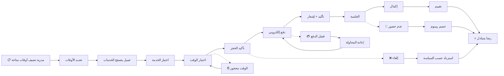

# JOURNEY MAP — BookingPro (SAAS-034)
> Owner: Journey Architect · Gate 1 · Persona: منى (مدربة)

## Flow (Mermaid)

## Stage Annotations
| Stage | User Action | Goal | Emotion | Friction | Screen |
|-------|-------------|------|---------|----------|--------|
| Trigger | منى تحدد أوقاتها | فتح الحجز | 😐 محايد | إعداد التقويم أول مرة | Availability Settings |
| Browse | عميل يتصفح المدربات | إيجاد الخدمة | 😊 متفائل | كثرة الخيارات | Provider List |
| Select | يختار الخدمة المناسبة | تحديد الجلسة | 🙂 مصمم | — | Service Detail |
| Pick Time | يختار وقتاً متاحاً | حجز الوقت | 😐 قلق | الوقت قد يكون محجوزاً | Calendar Picker |
| Book | يؤكد الحجز | تأمين الموعد | 🙂 سريع | — | Booking Review |
| Pay | يدفع عبر Stripe/Tap | تأكيد الدفع | 😟 متوتر | فشل الدفع أحياناً | Payment |
| Confirm | يتلقى الإشعار | راحة البال | 😊 راضٍ | — | Confirmation |
| Session | الحضور للجلسة | الاستفادة | 😃 إيجابي | — | — |
| Review | تقييم التجربة | مشاركة رأيه | 🙂 متفاعل | — | Review Form |

## Ranked Friction Log
1. **[High]** جدولة المواعيد يدوياً عبر المراسلة — تقويم آني مع فتح أوقات
2. **[High]** تأخر الدفع — دفع مسبق إجباري
3. **[Med]** إلغاء اللحظة الأخيرة — سياسة إلغاء مع رسوم
4. **[Med]** تذكير العملاء — إشعارات تلقائية قبل 24 ساعة وساعة
5. **[Low]** العميل يحجز نفس الوقت مع اثنين — منع تعارض الحجوزات

**Rule:** Every later feature MUST trace to a stage above.
