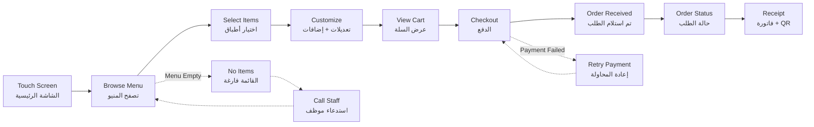

# JOURNEY MAP — KioskPro (SAAS-045)
> Owner: Journey Architect · Gate 1 · Persona: محمد (صاحب مطعم)

## Flow (Mermaid)

## Stage Annotations
| Stage | User Action | Goal | Emotion | Friction | Screen |
|-------|-------------|------|---------|----------|--------|
| Browse | يلمس فئة من القائمة | تصفح سريع | 😊 سهل | صور الأطباق بطيئة التحميل | Menu Screen |
| Select | يضيف طبقاً للسلة | بناء الطلب | 🤔 مركز | تعديلات كثيرة تربك العميل | Item Detail |
| Customize | يختار إضافات (جبن إضافي، إلخ) | تخصيص الطلب | 🧐 مفكر | خيارات غير واضحة | Item Customizer |
| Checkout | يدفع عبر الشاشة | إتمام الطلب | 😰 قلق (الدفع) | بطاقة الائتمان لا تعمل | Payment |
| Wait | ينتظر الطلب | استلام الأكل | 😤 نافد الصبر | لا يعرف كم تبقى | Status Screen |
| Receipt | يأخذ الفاتورة | إثبات الشراء | ✅ راضٍ | لا يوجد خيار إرسال عبر واتساب | Receipt |

## Ranked Friction Log
1. [High] صور الأطباق بطيئة التحميل على الأجهزة اللوحية القديمة
2. [High] فشل الدفع يسبب إحباطاً كبيراً (يضطر لإعادة كل شيء)
3. [Med] شاشة اللمس لا تستجيب بسرعة
4. [Med] لا توجد لغة إنجليزية للمطاعم التي تخدم سياحاً
5. [Low] لا يوجد خيار إرسال الفاتورة عبر واتساب
