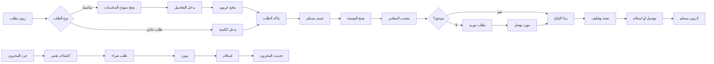

# JOURNEY MAP — BakeryMgt (SAAS-088)
> Owner: Journey Architect · Gate 1 · Persona: أمين باحاج

## Flow (Mermaid)

## Stage Annotations
| Stage | User Action | Goal | Emotion | Friction | Screen |
|-------|-------------|------|---------|----------|--------|
| استلام طلب | إدخال تفاصيل الطلب | تسجيل الطلب بدقة | 😊 متحمس | الزبون قد لا يعرف الكمية بالضبط | New Order |
| فتح وصفة | اختيار المنتج ← عرض الوصفة | معرفة المقادير | 😊 سهل | الوصفات كثيرة والبحث صعب | Recipe View |
| حساب مقادير | إدخال الكمية المطلوبة | ضبط المقادير | 😟 قلق | حسابات الكسور صعبة يدوياً | Scale Calculator |
| إنتاج | اتباع خطوات الوصفة | إنتاج متسق الجودة | 😐 مجتهد | خطوات عديدة قد تُنسى | Production |
| تغليف | تعبئة المنتج | تقديم جذاب | 😊 فخور | تكاليف التغليف مرتفعة | Packaging |
| توصيل | إرسال الطلب | وصول سريع | 😐 متوتر | الزبون قد لا يكون موجوداً | Delivery |

## Ranked Friction Log
1. [High] المقادير تحتاج حساب يومي حسب الكمية — أخطاء شائعة
2. [High] جودة المنتج تتفاوت — وصفات غير موحدة
3. [Med] حساب تكلفة القطعة لا يتم بدقة
4. [Med] إدارة طلبيات المناسبات الكبيرة تحتاج تنسيقاً خاصاً
5. [Low] المخزون لا يتتبع تلقائياً عند الإنتاج

**Rule:** Every later feature MUST trace to a stage above.
