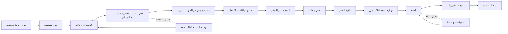

# JOURNEY MAP — HallBooking (SAAS-093)
> Owner: Journey Architect · Gate 1 · Persona: منال تبحث عن قاعة

## التدفق (Mermaid)

## شروحات المراحل
| المرحلة | إجراء المستخدم | الهدف | المشاعر | الاحتكاك | الشاشة |
|---------|----------------|-------|---------|----------|--------|
| البحث | تحديد المنطقة والتاريخ | إيجاد قاعات متاحة | 😊 متفائل | كثرة الخيارات | Search |
| المعرض | مشاهدة صور وفيديوهات القاعة | تقييم الجماليات | 🤔 متحمس | صور غير كافية | Gallery |
| الباقات | مقارنة الأسعار والمزايا | اختيار الباقة المناسبة | 😬 حائر | تفاصيل غير واضحة | Packages |
| الحجز | اختيار التاريخ وتأكيد التوفر | حجز القاعة | 😰 قلق | قلق من التعارض | Booking |
| العقد | توقيع العقد إلكترونياً | توثيق الاتفاق | 😌 مطمئن | طول العقد | Contract |
| التجهيزات | متابعة الموردين والتجهيزات | ضمان جاهزية كل شيء | 😊 مرتاح | ضعف التنسيق | Preparations |

## سجل الاحتكاك المرتب
1. [High] تعارض الحجوزات — تقويم فوري محدث آنياً
2. [High] صعوبة تنسيق الموردين — قائمة تحقق + إشعارات للجميع
3. [Med] عدم وضوح الباقات — مقارنة صورية + جدول مقارنة
4. [Med] تعقيد العقود — قوالب ذكية + توقيع إلكتروني
5. [Low] قلق يوم المناسبة — قائمة مهام + دعم فوري
